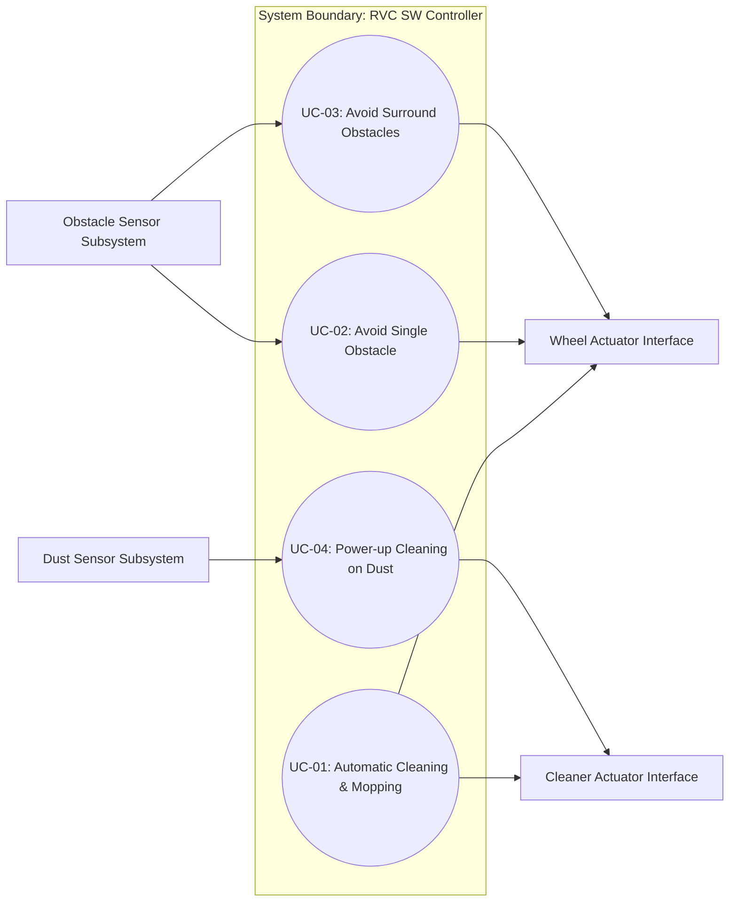
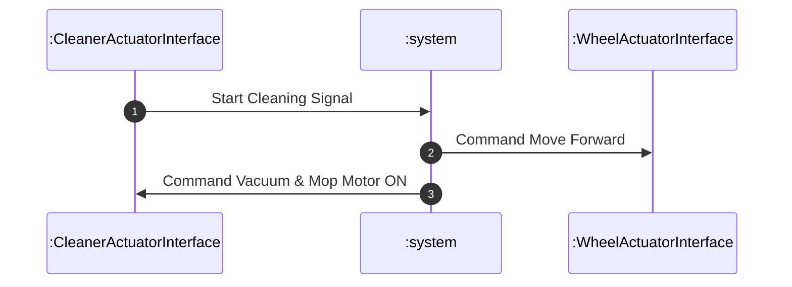
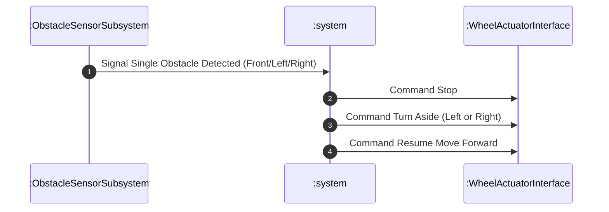
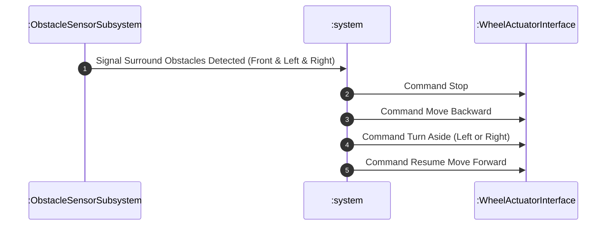
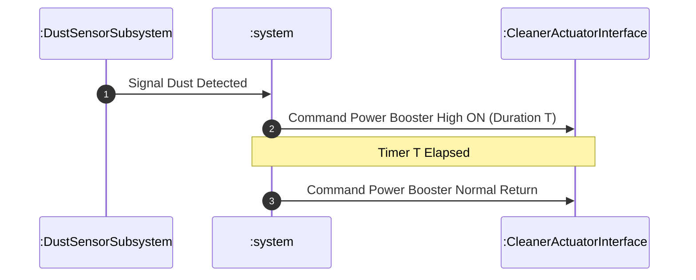
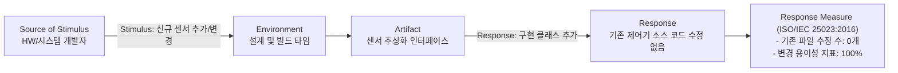
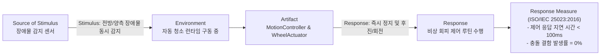

# Architectural Drivers Specification for RVC SW Controller

## 1. 개요 (Overview)
본 문서는 RVC SW Controller의 소프트웨어 아키텍처 설계를 결정짓는 주요 요소인 Architectural Drivers를 정의한다. 주요 기능 요구사항(Primary Functionality: Use Case Model 및 ASR), 품질 속성 시나리오(QAS), 그리고 비즈니스/기술적 제약사항(Constraints)을 통합하여 정리한다.

---

## 2. Primary Functionality (Use-Case Model)

### 2.1 Use Case Diagram (UCD)

`RVC SW Controller`의 시스템 경계(System Boundary) 내 Use Case 및 외부 시스템/장치 Actor 간의 관계는 다음과 같다.

---

### 2.2 Use-Case List 및 ASR 선정

| ID | Title | Summary of Description | Priority (I/D) | ASR? |
| :--- | :--- | :--- | :---: | :---: |
| **UC-01** | Automatic Cleaning & Mopping | 기본 직진 이동을 수행하며 바닥 청소 및 물걸레질을 자동으로 제어함 | I: 상 / D: 중 | **Y** |
| **UC-02** | Avoid Single Obstacle | 전방/측면 단일 장애물 감지 시 정지 후 좌/우 회전하여 회피 주행함 | I: 상 / D: 중 | **Y** |
| **UC-03** | Avoid Surround Obstacles | 전방 및 양측면 동시 장애물 감지 시 후진 후 회전하여 막힌 구역 탈출 | I: 상 / D: 상 | **Y** |
| **UC-04** | Power-up Cleaning on Dust | 먼지 감지 시 지정 시간 동안 청소 출력을 강화 후 정상 복귀 | I: 중 / D: 하 | N |

*Note: Importance(I) 및 Difficulty(D)가 '상'인 요구사항을 ASR(Y)로 선정함.*

---

### 2.3 Use Case Specification & System Sequence Diagram (SSD)

#### UC-01: Automatic Cleaning & Mopping (기본 직진 청소 및 물걸레질)
- **Primary Actor**: Cleaner Actuator Interface, Wheel Actuator Interface
- **Description**: RVC가 바닥 면을 청소하고 물걸레질을 수행하며 기본적으로 직진 이동한다.
- **Pre-condition**: RVC 청소 전원 ON 상태 및 장애물 미감지.
- **Post-condition**: 바닥 청소 및 물걸레질 모터 작동 및 직진 이동 유지.

#### UC-02: Avoid Single Obstacle (단일/측면 장애물 회피)
- **Primary Actor**: Obstacle Sensor Subsystem, Wheel Actuator Interface
- **Description**: 전방 또는 측면 장애물 감지 시 청소를 정지하고, 좌/우 회전 후 직진 청소를 재개한다.
- **Pre-condition**: 직진 청소 진행 중.
- **Post-condition**: 장애물 회피 후 새로운 방향으로 직진 청소 재개.

#### UC-03: Avoid Surround Obstacles (전방 및 양측면 장애물 회피)
- **Primary Actor**: Obstacle Sensor Subsystem, Wheel Actuator Interface
- **Description**: 전방, 좌측, 우측 모두에서 장애물 감지 시 후진(Move backward) 후, 좌/우 회전하여 직진 청소를 재개한다.
- **Pre-condition**: 전방 및 양측면 장애물 동시 감지.
- **Post-condition**: 후진 및 회전을 통해 막힌 구역 탈출 후 직진 청소 재개.

#### UC-04: Power-up Cleaning on Dust (먼지 감지 시 집중 청소)
- **Primary Actor**: Dust Sensor Subsystem, Cleaner Actuator Interface
- **Description**: 먼지가 감지되면 지정된 시간 동안 청소 출력을 강화(Power-up)한다.
- **Pre-condition**: 일반 청소 모드 작동 중.
- **Post-condition**: 청소 모터 출력 강화 후 지정 시간 경과 시 일반 출력 복귀.

---

## 3. Quality Attribute Scenarios (QAS)

### 3.1 QAS List 표

| ID | Quality Attribute | Refinement(Title) | Scenario Description | Priority (I/D) |
| :--- | :--- | :--- | :--- | :---: |
| **QAS-01** | Modifiability | 센서 확장성 및 변경 용이성 | 새로운 장애물/먼지 센서 추가 또는 사양 변경 시 기존 제어기 소스 코드 수정 없이(0 Files Modified) 유연하게 연동함 | I: 상 / D: 중 |
| **QAS-02** | Reliability & Safety | 장애물 회피 실시간 신뢰성 및 안전성 | 전방 및 양측면 장애물 동시 감지 시 100ms 이내에 정지 후 안전 회피 제어 동작을 수행하고 충돌 결함률 0% 달성 | I: 상 / D: 상 |

*Note:*
- **Priority**: `I`: Importance (Business/사용자 관점 중요도), `D`: Difficulty (기술적 난이도/위험도), 구분: 상 / 중 / 하

---

### 3.2 QAS 상세 내용

#### QAS-01: 센서 확장성 및 변경 용이성 (Modifiability)

| QAS 6개 구성 요소 | 상세 내용 |
| :--- | :--- |
| **Source of Stimulus** | HW / 시스템 개발자 |
| **Stimulus** | 신규 장애물/먼지 센서 추가 또는 기존 센서 사양 변경 요청 |
| **Artifact** | 센서 추상화 인터페이스 (`ObstacleSensorInterface`, `DustSensorInterface`) |
| **Environment** | 소프트웨어 설계 및 컴파일/빌드 타임 (Design & Build Time) |
| **Response** | 기존 `CleaningController` 및 `MotionController` 수정 없이 신규 센서 클래스 추가 연동 |
| **Response Measure** | **ISO/IEC 25023:2016 Modifiability Measure** - 기존 소스 코드 변경 파일 수: **0개 (0 Files)** - 변경 모듈 비율 (Ratio of Modified Components): **0%** |

---

#### QAS-02: 장애물 회피 실시간 신뢰성 및 안전성 (Reliability & Safety)

| QAS 6개 구성 요소 | 상세 내용 |
| :--- | :--- |
| **Source of Stimulus** | 장애물 감지 센서 서브시스템 (Obstacle Sensor Subsystem) |
| **Stimulus** | 전방 및 양측면 동시 장애물 감지 신호 발생 |
| **Artifact** | 주행 제어기 및 구동 모터 인터페이스 (`MotionController`, `WheelDriverInterface`) |
| **Environment** | 실내 바닥 자동 청소 구동 중 (Runtime) |
| **Response** | 신호 즉시 구동 정지(Stop) 후 100ms 이내 후진 및 회전 회피 실행 |
| **Response Measure** | **ISO/IEC 25023:2016 Time Behavior & Fault Avoidance Measure** - 제어 응답 지연 시간 (Response Time): **< 100ms** - 장애물 충돌 결함 발생률 (Collision Failure Rate): **0%** |

---

## 4. Constraints (제약사항)

### 4.1 Business Constraints (비즈니스 제약사항)

| ID | Constraint Name | Description |
| :--- | :--- | :--- |
| **BC-01** | 자동 청소 기능 집중 | 하드웨어 세부 설계 및 제조 비용 논의는 제외하며, 자동 청소 SW 제어 핵심 기능의 완성도와 확장성에 집중함. |
| **BC-02** | 실내 가정 환경 특화 | 일반 가정집 실내 바닥(Household surface) 조건에서의 사용 시나리오를 기본 환경으로 한정함. |

### 4.2 Technical Constraints (기술적 제약사항)

| ID | Constraint Name | Description |
| :--- | :--- | :--- |
| **TC-01** | C++ 구현 언어 | 시스템 소프트웨어 코드는 C++ 언어로 작성 및 구현한다. |
| **TC-02** | SOLID 설계 원칙 | 객체지향 분석 및 설계 시 SOLID 원칙(단일 책임, 개방-폐쇄, 리스코프 치환, 인터페이스 분리, 의존성 역전)을 엄격히 적용한다. |
| **TC-03** | Google Test (gtest) | 단위 및 통합 검증을 위한 테스트 프레임워크로 Google Test(gtest)를 사용한다. |
| **TC-04** | HW 제어 세부사항 배제 | 하드웨어 레벨의 디바이스 드라이버 구현 등 세부 HW 제어 코드는 인터페이스로 추상화하여 SW 제어 로직과 분리한다. |
