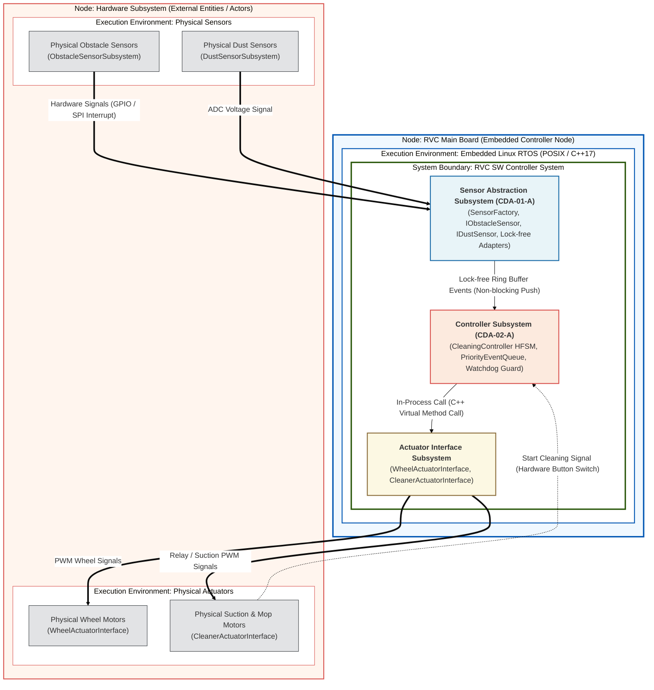
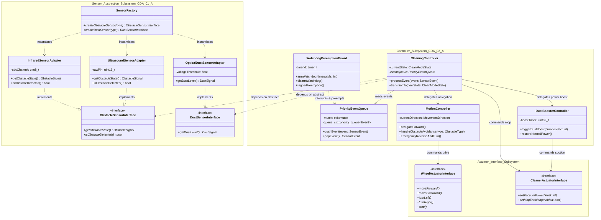
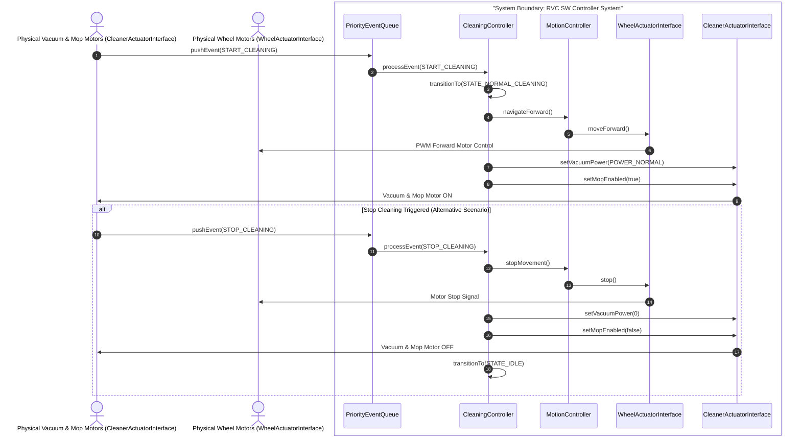
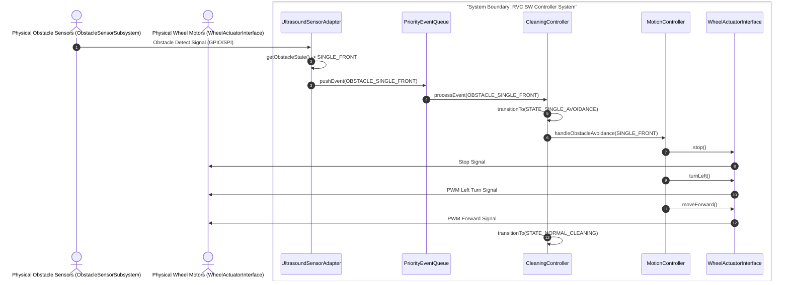
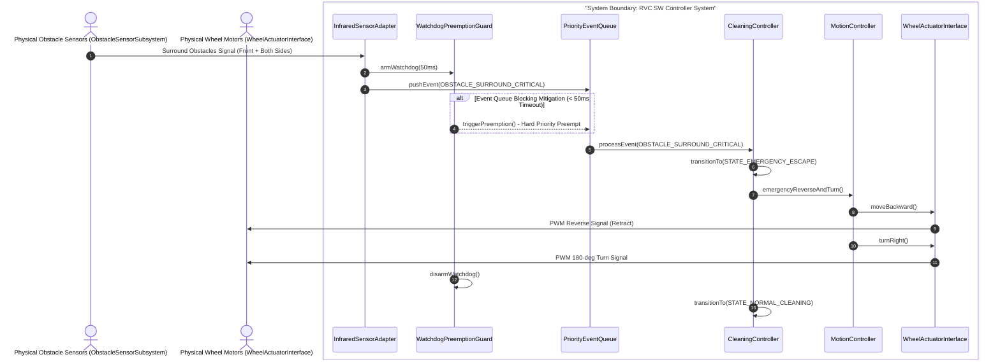
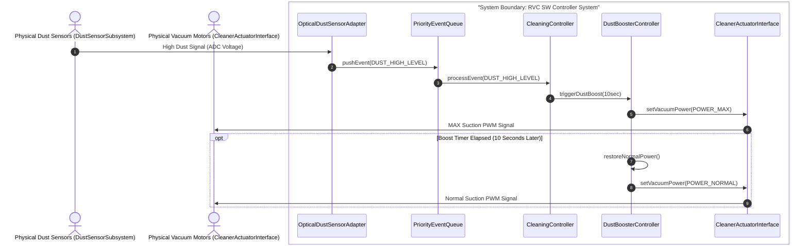
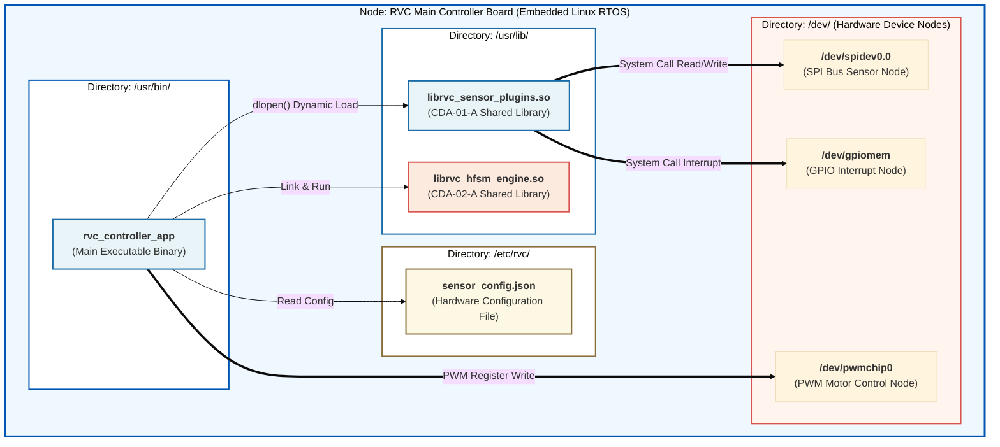

# Architecture Design Specification for RVC SW Controller

## 1. 개요 (Overview)

본 문서는 RVC SW Controller의 최종 Architecture Design Decision(`docs/CDA_Evaluation_and_Design_Decision.md`), Architectural Drivers(`docs/Architectural_Drivers.md`), 도메인 모델(`docs/Domain_Model.md`)을 바탕으로 작성된 공식 **Architecture Design 명세서**이다.

상위 산출물(UCD, SSD, 도메인 모델)에서 식별된 외부 엔티티(`ObstacleSensorSubsystem`, `DustSensorSubsystem`, `WheelActuatorInterface`, `CleanerActuatorInterface`)와의 1:1 일관성을 엄격히 유지한다. C++17 개발 환경 및 **SOLID Principles**(SRP, OCP, LSP, ISP, DIP)를 전면 준수하며, `gtest/gmock` 기반 단위 테스트 구동 체계를 보장한다.

---

## 2. Overall Architecture

RVC SW Controller의 전체 아키텍처는 센서 추상화 및 플러그인 레이어(`CDA-01-A`), 상태 기반 실시간 선점형 제어 레이어(`CDA-02-A`), 그리고 구동기 제어 레이어가 유기적으로 연결된 아키텍처 구조를 갖는다.

### 2.1 Overall Architecture Diagram

Overall Architecture Diagram은 실행 노드(Node), 실행 환경(Execution Environment), 시스템 바운더리(System Boundary), 메인 서브시스템 레이어, 그리고 UCD/SSD에서 식별된 4대 외부 Entity(`ObstacleSensorSubsystem`, `DustSensorSubsystem`, `WheelActuatorInterface`, `CleanerActuatorInterface`) 간의 거시적 관계와 프로토콜을 모델링한 최상위 구조도이다.

### 2.2 노드 명세 및 통신 프로토콜 (Node Specifications & Protocols)

1. **Node: RVC Main Board (임베디드 메인 제어 노드)**
   - **역할**: POSIX 기반 C++17 실행 환경에서 동작하며, RVC SW Controller의 핵심 제어 로직을 구동한다.
   - **통신 프로토콜**: 내부 서브시스템 간 C++ Virtual Method Call 및 락프리 링 버퍼를 통해 1ms 이내로 초고속 데이터 전송을 수행한다.

2. **Node: Hardware Subsystem (물리 하드웨어 모듈 노드 - UCD/SSD 외부 액터)**
   - **역할**: UCD 및 SSD에서 정한 전방/측면 장애물 감지 센서(`ObstacleSensorSubsystem`), 먼지 감지 센서(`DustSensorSubsystem`), 바퀴 구동 모터(`WheelActuatorInterface`), 흡입/물걸레 모터 및 전원 인터페이스(`CleanerActuatorInterface`) 노드이다.
   - **통신 프로토콜**: GPIO / SPI 타이머 인터럽트 및 PWM 출력 신호를 통해 센서 추상화 및 액추에이터 레이어와 직접 인터페이스한다.

---

## 3. Structure View

### 3.1 Static Structure Diagram

Static Structure Diagram은 Design Decision을 반영하여 C++ 클래스 및 인터페이스 구조를 UML Class Diagram 형태로 모델링한다. 2.1장의 메인 서브시스템 블록 명칭과 **1:1로 동일한 `namespace` 명칭**을 사용하여 컴포넌트를 그룹화한다.

### 3.2 Element List

#### 1) Sensor Abstraction Subsystem (CDA-01-A)

| Name | Responsibility | Relevant ADs |
| :--- | :--- | :--- |
| **ObstacleSensorInterface** | 장애물 감지 센서의 공통 pure virtual interface. DIP 및 ISP 원칙을 준수하여 구체 센서 기술을 추상화함. | QA1 (QAS-01), CDA-01-A |
| **DustSensorInterface** | 먼지 감지 센서의 공통 pure virtual interface. 먼지 농도 측정 데이터를 제공함. | QA1 (QAS-01), CDA-01-A |
| **SensorFactory** | Abstract Factory 패턴을 통해 런타임/컴파일 타임에 물리 센서 어댑터 객체를 생성 및 주입(DIP)함. | QA1 (QAS-01), CDA-01-A |
| **UltrasoundSensorAdapter** | 초음파 센서 하드웨어 전용 플러그인 어댑터. `ObstacleSensorInterface`를 실현(LSP 준수)함. | QA1 (QAS-01), CDA-01-A |
| **InfraredSensorAdapter** | 적외선 센서 하드웨어 전용 플러그인 어댑터. `ObstacleSensorInterface`를 실현(LSP 준수)함. | QA1 (QAS-01), CDA-01-A |
| **OpticalDustSensorAdapter** | 광학 먼지 센서 하드웨어 전용 어댑터. `DustSensorInterface`를 실현함. | QA1 (QAS-01), CDA-01-A |

#### 2) Controller Subsystem (CDA-02-A)

| Name | Responsibility | Relevant ADs |
| :--- | :--- | :--- |
| **CleaningController** | 최상위 청소 주기를 총괄하는 계층형 유한 상태 머신(HFSM Top State). SRP 원칙을 준수함. | QA2 (QAS-02), CDA-02-A |
| **PriorityEventQueue** | 비상 장애물 이벤트에 최우선순위를 부여하여 100ms 이내 실시간 선점 디스패치를 보장하는 우선순위 큐. | QA2 (QAS-02), CDA-02-A |
| **WatchdogPreemptionGuard** | 큐 블로킹 시 50ms 이내 하드웨어 타이머 인터럽트로 선점을 하드 제어하는 세이프티 가디언(Mitigation). | QA2 (QAS-02), CDA-02-A |
| **MotionController** | 회피 주행 및 막힘 구역 탈출을 담당하는 하위 상태 머신(Sub-HFSM). 바퀴 모터를 제어함. | QA2 (QAS-02), CDA-02-A |
| **DustBoosterController** | 먼지 집중 구역 감지 시 청소 흡입 출력을 강하게 제어하는 하위 상태 머신(Sub-HFSM). | QA2 (QAS-02), CDA-02-A |

#### 3) Actuator Interface Subsystem

| Name | Responsibility | Relevant ADs |
| :--- | :--- | :--- |
| **WheelActuatorInterface** | 좌/우 바퀴 모터 하드웨어를 제어하기 위한 구동기 추상 인터페이스. | Primary UC-01~03 |
| **CleanerActuatorInterface** | 흡입 모터 및 물걸레 구동 모듈을 제어하기 위한 액추에이터 추상 인터페이스. | Primary UC-01, UC-04 |

---

## 4. Behavior View

### 4.1 UC-01 Automatic Cleaning & Mopping Use Case Behavior Model

#### 1) Behavior Diagram

#### 2) Behavior Description
`CleanerActuatorInterface`(전원/청소 스위치 인터페이스)로부터 청소 시작 신호가 입력되면 `PriorityEventQueue`를 거쳐 `CleaningController`가 `STATE_NORMAL_CLEANING` 상태로 전이한다. 직진 주행 명령은 `MotionController`를 거쳐 `WheelActuatorInterface`로 전달되고, 흡입 모터 및 물걸레 구동 명령은 `CleanerActuatorInterface`를 거쳐 물리 모터로 전달된다. 정지 신호 발생 시 대체 스케줄에 따라 모터를 차단하고 IDLE 상태로 안전하게 전이한다.

---

### 4.2 UC-02 Avoid Single Obstacle Use Case Behavior Model

#### 1) Behavior Diagram

#### 2) Behavior Description
전방 단일 장애물 감지 시 `UltrasoundSensorAdapter`가 데이터를 캡처하여 `PriorityEventQueue`에 장애물 이벤트를 발송한다. `CleaningController`는 단일 장애물 회피 상태로 전환하며, `MotionController`는 즉시 정지 후 좌측으로 회전하고 경로가 확보되면 직진 청소 모드로 복귀한다.

---

### 4.3 UC-03 Avoid Surround Obstacles Use Case Behavior Model

#### 1) Behavior Diagram

#### 2) Behavior Description
전방 및 양측면 동시 장애물 감지 시 비상 시퀀스가 발동한다. `WatchdogPreemptionGuard`가 타이머를 구동하여 50ms 이내 하드 선점을 보장한다. `CleaningController`는 `STATE_EMERGENCY_ESCAPE` 상태로 진입하며, `MotionController`를 통해 후진 후 180도 우회 회전을 실행하여 갇힘 구역을 안전하게 탈출한다 (응답 시간 < 100ms 만족).

---

### 4.4 UC-04 Power-up Cleaning on Dust Use Case Behavior Model

#### 1) Behavior Diagram

#### 2) Behavior Description
바닥 먼지 급증 시 `OpticalDustSensorAdapter`가 이벤트를 전송하고, `CleaningController`는 `DustBoosterController`를 구동하여 흡입 출력을 최고 수준(`POWER_MAX`)으로 즉시 강화한다. 10초 타이머가 만료되면 자동으로 일반 흡입 출력으로 복원된다.

---

## 5. Deployment View

### 5.1 Artifact Deployment Diagram

아티팩트 배포 구조도는 타겟 OS(Embedded Linux RTOS) 파일시스템 상의 실제 물리적 아티팩트(`.bin`, `.so`, `.json`, 하드웨어 장치 노드) 배치 체계를 크게 시각화한 것이다.

### 5.2 아티팩트 배포 명세 (Artifact Deployment Specification)

1. **`/usr/bin/rvc_controller_app` (메인 실행 파일)**:
   - C++17 기반으로 컴파일된 메인 제어 바이너리. 부팅 시 daemon 프로세스로 상주 실행되며 HFSM 상태 엔진과 큐 관리를 수행함.

2. **`/usr/lib/librvc_sensor_plugins.so` (센서 플러그인 동적 공유 라이브러리 - CDA-01-A)**:
   - Abstract Factory 및 어댑터 패턴이 적용된 센서 추상화 전용 공유 라이브러리. `dlopen()`을 통해 센서 드라이버를 동적 로드하여 소스 코드 재컴파일 없는 확장성을 제공함.

3. **`/usr/lib/librvc_hfsm_engine.so` (계층형 상태 머신 라이브러리 - CDA-02-A)**:
   - 계층형 상태 머신 및 우선순위 선점형 이벤트 큐, Watchdog 타이머 인터럽트 로직을 포함하는 공유 라이브러리.

4. **`/etc/rvc/sensor_config.json` (하드웨어 설정 파일)**:
   - 런타임에 센서 포트, 핀 번호, 래치 딜레이, 전압 문턱값 등을 정의하는 JSON 파일.

5. **`/dev/` 하드웨어 디바이스 노드 (`/dev/spidev0.0`, `/dev/gpiomem`, `/dev/pwmchip0`)**:
   - 리눅스 커널 디바이스 드라이버 노드로, 하드웨어 신호 수신 및 모터 PWM 제어 신호 출력을 위한 시스템 인터페이스 매핑을 담당함.
