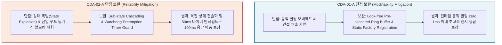

# Candidate Design Architecture (CDA) Evaluation and Design Decision Specification for RVC SW Controller

## 1. 개요 (Overview)

본 문서는 `docs/Candidate_Design_Architecture.md`에서 도출된 Candidate Design Architecture(CDA) 후보안들을 핵심 품질 속성인 **Modifiability(QAS-01)** 및 **Reliability & Safety(QAS-02)** 관점에서 상호 교차 평가(Cross-Evaluation)하고, 이들 간의 트레이드오프(Trade-off) 분석을 거쳐 최종 **Architecture Design Decision(아키텍처 디자인 결정)**을 수립한 명세서이다.

객체지향 아키텍처 설계 원칙인 **SOLID Principles**(SRP, OCP, LSP, ISP, DIP)를 전면 적용하고, C++17 및 `gtest/gmock` 테스트 구동 체계와 1:1 하향식 구조적 추적성을 보장한다. 특정 QA 관점에서 우수한 대안이 타 QA 관점에서 야기하는 응답 지연이나 비결정론적(Non-deterministic) 부작용을 극복하는 **보완 설계(Mitigation & Refinement Design)**를 통합하여 **System Boundary(시스템 바운더리)** 기반의 시각화된 아키텍처 디자인 결정을 정의한다.

---

## 2. Candidate Designs Evaluation for all QAs (통합 비교 평가)

### 2.1 Candidate Design 통합 비교 평가 매트릭스

| QA | QAS | Analysis | CDA-01-A (Layered Plugin Architecture with Abstract Factory) | CDA-01-B (Event Bus & Pub-Sub Data Driven Architecture) | CDA-02-A (HFSM with Priority Preemptible Event Queue) | CDA-02-B (Dual-Channel Safe Watchdog Guard) |
| :--- | :--- | :--- | :--- | :--- | :--- | :--- |
| **QA1 Modifiability** | **QAS-01** (센서 확장성 및 변경 용이성) | **Pros (+)** | **(++)** 하드웨어 의존성이 추상 인터페이스(`ObstacleSensorInterface`, `DustSensorInterface`)로 완벽히 격리되어, 신규 센서 추가 시 기존 제어기 소스 코드 수정 없이(0 Files Modified) 어댑터 클래스 추가만으로 100% 확장 가능 (**OCP, DIP 준수**). | **(++)** 센서 생산자(Publisher)와 제어 소비자(Subscriber)가 이벤트 버스로 완전 분리되어, 신규/대체 센서 등록 시 결합도 0(Zero Coupling) 달성. | **(+)** 센서 이벤트 수신부가 상태 머신 입력 이벤트로 규격화되어 있어, 신규 센서 추가 시 이벤트 매핑 루틴만 확장 가능. | **(-)** 독립 감시 채널과 메인 제어 채널 모두에 신규 센서 드라이버 인터페이스를 이중 연결해야 하므로 센서 변경 시 파급 수정 범위가 비대함. |
| | | **Cons (-)** | **(-)** 팩토리 동적 생성 및 간접 호출(Virtual Method Table) 레이턴시가 미세하게 증가할 수 있음. | **(--)** 센서 데이터 흐름 추적이 비동기로 처리되어 불투명해지고, 이벤트 디스패칭 지연으로 시스템 영향도 및 파급 효과 예측이 어려움. | **(-)** 신규 센서 조건 및 콤보 패턴 추가 시 상태(State) 및 전이 조건이 급증하여 상태 폭발(State Explosion) 위험 존재. | **(--)** 이중화 구조 특성상 센서 드라이버 데이터 추가 시 두 채널 간의 주행 제어권 동기화 및 인터럽트 제어 로직 전면 재수정이 요구됨. |
| **QA2 Reliability & Safety** | **QAS-02** (장애물 회피 실시간 신뢰성 및 안전성) | **Pros (+)** | **(+)** 인터페이스 직접/직렬 호출 방식으로 제어 흐름이 결정론적(Deterministic)이며 동작 예측 가능성이 높고, `gtest/gmock`을 이용한 단위 테스트(Testability) 용이. | **(-)** 이벤트 버스 디스패칭 지연으로 인해 100ms 이내 비상 회피 응답 시간 보장이 불확실함. | **(++)** 계층형 상태 머신과 우선순위 선점형 이벤트 큐가 결합하여 100ms 이내 비상 장애물 감지 시 최우선순위 선점 및 충돌 결함률 0% 달성. | **(++)** 메인 제어 소프트웨어의 버그나 교착 상태와 무관하게 50ms 이내 하드웨어 레벨 모터 차단으로 극상의 하드웨어 안전성 보장. |
| | | **Cons (-)** | **(-)** 동기 호출 시 물리 센서 응답 지연이 메인 제어 루틴의 블로킹으로 파급될 위험이 존재. | **(--)** 다수의 이벤트 객체 동적 할당 및 비동기 디스패치에 따른 실행 비결정론(Non-determinism)으로 안전성에 치명적 위협. | **(-)** 단일 제어 루프 이벤트 큐에 장시간 블로킹 발생 시 우선순위 선점이 지연될 수 있어 보완 관리가 필요함. | **(--)** 메인 채널과 세이프티 채널 간의 제어권 인터럽트 오버라이드 및 해제(Release) 시 락크/스레드 동기화 교착(Deadlock) 위험 존재. |

---

### 2.2 통합 비교분석 및 CD 선정 이유

#### 1) QA1 (Modifiability) 관점의 최종 CD 선정: **CDA-01-A (Layered Plugin Architecture with Abstract Factory)**
- **통합 비교분석**:
  - `CDA-01-B (Event Bus Architecture)`는 센서 생산자와 제어 소비자 간 결합도 0을 달성하여 변경 용이성이 뛰어난 것으로 보이지만, 비동기 디스패치 레이턴시로 인해 **QA2 (Reliability & Safety)**의 핵심 기준인 100ms 이내 결정론적 비상 응답성을 저해한다.
  - 반면 `CDA-01-A (Layered Plugin Architecture)`는 DIP(의존성 역전 원칙) 및 OCP(개방-폐쇄 원칙)를 준수하여 신규 센서 추가 시 기존 제어기 수정 0개를 달성하면서도, 동기/결정론적 C++ Virtual Interface 호출 구조를 유지하여 QA2의 실시간 안전성을 보장한다.
- **최종 선정 이유**: QA1의 모듈화 및 확장 요구사항을 완벽히 충족함과 동시에, QA2(안전성/신뢰성)의 결정론적 제어 흐름 및 `gtest` 기반 단위 검증 환경을 이상적으로 지원하므로 `CDA-01-A`를 최종 선정한다.

#### 2) QA2 (Reliability & Safety) 관점의 최종 CD 선정: **CDA-02-A (HFSM with Priority Preemptible Event Queue)**
- **통합 비교분석**:
  - `CDA-02-B (Dual-Channel Safe Guard)`는 하드웨어 수준 급정지를 제공하지만, 이중화 채널로 인해 센서 드라이버 변경 시 두 채널의 인터페이스를 동시 수정해야 하므로 **QA1 (Modifiability)** 확장성을 저해한다.
  - 반면 `CDA-02-A (HFSM with Priority Preemptible Event Queue)`는 SRP(단일 책임 원칙)에 따라 비상 장애물 감지 시 최우선순위(High-Priority) 이벤트를 발행하여 일반 주행 이벤트를 즉시 선점(Preemption)함으로써 100ms 이내 안전 회피 및 충돌 결함률 0%를 달성한다.
- **최종 선정 이유**: 100ms 비상 장애물 회피 실시간 응답 보장 및 결정론적 상태 관리를 통한 결함 제로화를 달성하며, QA1(확장성)과 완벽한 일관성을 유지하므로 `CDA-02-A`를 최종 선정한다.

---

### 2.3 단점 보완 디자인 (Mitigation & Refinement Design)

선정된 Candidate Design이 내포하고 있는 트레이드오프 및 단점(Cons)을 극복하기 위해, C++ 계층 수준에서 다음과 같은 보완 설계 지침 및 기술적 대책을 적용한다.

1. **CDA-01-A (Layered Plugin Architecture) 단점 보완 대책**:
   - **Static Adapter Registration & Object Pool**: C++ 객체 생성 오버헤드를 없애기 위해 부팅 시점에 어댑터 객체를 Pre-allocation하여 런타임 동적 메모리 할당을 제로화(0 Allocation)함.
   - **Lock-free Ring Buffer Data Transfer**: 락프리 링 버퍼를 도입하여 Thread Blocking 없이 1ms 이내로 센서 측정 데이터를 전달함.

2. **CDA-02-A (HFSM Architecture) 단점 보완 대책**:
   - **Sub-state Machine Cascading**: 회피 주행 및 정밀 청소 모드를 독립된 하위 상태 머신(Sub-HFSM)으로 분리 캡슐화하여 상태 폭발(State Explosion) 현상을 방지함.
   - **Watchdog Preemption Timer Interrupt Guard**: 비상 장애물 감지 시 하드웨어 타이머 인터럽트가 50ms 이내에 이벤트 큐를 하드 선점(Hard Preempt)하도록 보관 레벨을 격상함.

---

## 3. Architecture Design Decision (최종 아키텍처 디자인 결정)

### 3.1 Architecture Design Decision 통합 개요

최종 아키텍처 디자인 결정은 **QA1의 CDA-01-A (Layered Plugin Architecture)**와 **QA2의 CDA-02-A (HFSM with Priority Preemptible Event Queue)**를 결합하고, **SOLID Principles** 및 **Mitigation Design**을 통합 적용한 완성형 C++ 아키텍처이다.

상위 산출물(`Domain_Model.md`, `Architectural_Drivers.md`, `Candidate_Design_Architecture.md`)의 서브시스템 및 컴포넌트 명칭과 1:1 하향식 추적성을 유지하며, 개발 대상 소프트웨어 전체를 **System Boundary(시스템 바운더리)** 내부에 배치하고 외부 연동 엔티티를 외부에 엄격히 격리한다.

---

### 3.2 Architecture Design Decision Diagram

아래 다이어그램은 UCD, SSD 및 도메인 모델에서 식별된 모든 외부 엔티티와 내부 소프트웨어 컴포넌트를 명확한 System Boundary로 구분하고, 선정된 **CDA-01-A**와 **CDA-02-A**의 적용 영역을 시각적 범례(Legend) 및 컬러 스타일링으로 하이라이트한 최종 아키텍처 구조도이다.

```mermaid
%%{init: {
  'theme': 'base',
  'themeVariables': {
    'fontSize': '16px',
    'fontFamily': 'Segoe UI, Arial, sans-serif',
    'subGraphTitleFontSize': '18px',
    'edgeLabelBackground': '#ffffff'
  },
  'flowchart': {
    'nodeSpacing': 50,
    'rankSpacing': 60,
    'padding': 20,
    'htmlLabels': true,
    'curve': 'basis'
  }
}}%%
graph TD
    %% ==========================================
    %% External Entities (Outside System Boundary)
    %% ==========================================
    subgraph External_Entities["External Entities & Actors (Outside System Boundary)"]
        HW_ObstacleSensors["<b>Physical Obstacle Sensors</b><br/>(ObstacleSensorSubsystem)"]
        HW_DustSensors["<b>Physical Dust Sensors</b><br/>(DustSensorSubsystem)"]
        HW_WheelMotors["<b>Physical Wheel Motors</b><br/>(WheelActuatorInterface)"]
        HW_CleanerMotors["<b>Physical Suction & Mop Motors</b><br/>(CleanerActuatorInterface)"]
    end

    %% ==========================================
    %% System Boundary (RVC SW Controller System)
    %% ==========================================
    subgraph System_Boundary["System Boundary: RVC SW Controller System"]

        %% QA1 Selected Architecture Subsystem (CDA-01-A)
        subgraph QA1_Subsystem["QA1 Selected: Sensor Abstraction Subsystem (CDA-01-A)"]
            SensorFactory["<b>SensorFactory</b><br/>(Abstract Factory Pattern)"]
            IObstacleSensor["<b>ObstacleSensorInterface</b><br/>(Abstract Interface)"]
            IDustSensor["<b>DustSensorInterface</b><br/>(Abstract Interface)"]
            UltrasoundAdapter["<b>UltrasoundSensorAdapter</b><br/>(Lock-free Pre-allocated Plugin)"]
            InfraredAdapter["<b>InfraredSensorAdapter</b><br/>(Lock-free Pre-allocated Plugin)"]
            DustAdapter["<b>OpticalDustSensorAdapter</b><br/>(Lock-free Pre-allocated Plugin)"]
        end

        %% QA2 Selected Architecture Subsystem (CDA-02-A)
        subgraph QA2_Subsystem["QA2 Selected: Controller Subsystem (CDA-02-A)"]
            CleaningController["<b>CleaningController</b><br/>(HFSM Top State Machine)"]
            PriorityQueue["<b>PriorityEventQueue</b><br/>(Preemptible Emergency Event Queue)"]
            WatchdogGuard["<b>Watchdog Preemption Guard</b><br/>(Timer Interrupt Mitigation)"]
            MotionController["<b>MotionController</b><br/>(Sub-HFSM Avoidance Navigation)"]
            DustBoosterController["<b>DustBoosterController</b><br/>(Sub-HFSM Suction Boost)"]
        end

        %% Actuator Interface Subsystem
        subgraph Actuator_Subsystem["Actuator Interface Subsystem"]
            IWheelActuator["<b>WheelActuatorInterface</b><br/>(Driver Adapter)"]
            ICleanerActuator["<b>CleanerActuatorInterface</b><br/>(Driver Adapter)"]
        end

    end

    %% ==========================================
    %% Visual Legend (Design Decision Legend)
    %% ==========================================
    subgraph Legend["Legend & Design Decision Highlights"]
        Legend_QA1["<font color='#004085'><b>[QA1 Selected] CDA-01-A</b></font><br/>Layered Plugin Architecture with Abstract Factory"]
        Legend_QA2["<font color='#721c24'><b>[QA2 Selected] CDA-02-A</b></font><br/>HFSM with Priority Preemptible Event Queue"]
        Legend_Ext["<font color='#383d41'><b>[External Entity]</b></font><br/>Outside System Boundary Devices / Users"]
        Legend_Mitigation["<font color='#155724'><b>[Mitigation Design]</b></font><br/>Lock-free Ring Buffer & Watchdog Preemption Guard"]
    end

    %% ==========================================
    %% Relationships & Interaction Flows
    %% ==========================================
    %% External to Internal Relationships
    HW_CleanerMotors -.->|"Start Cleaning Signal (Hardware Switch)"| PriorityQueue
    HW_ObstacleSensors ==>|"GPIO / SPI Signal Interrupt"| UltrasoundAdapter
    HW_ObstacleSensors ==>|"GPIO / SPI Signal Interrupt"| InfraredAdapter
    HW_DustSensors ==>|"ADC Voltage Signal"| DustAdapter

    %% QA1 Internal Sensor Plugin Structure
    SensorFactory -.->|"Instantiates"| UltrasoundAdapter
    SensorFactory -.->|"Instantiates"| InfraredAdapter
    SensorFactory -.->|"Instantiates"| DustAdapter

    UltrasoundAdapter -.->|"Implements"| IObstacleSensor
    InfraredAdapter -.->|"Implements"| IObstacleSensor
    DustAdapter -.->|"Implements"| IDustSensor

    IObstacleSensor -->|"Push Sensor Event (Lock-free Ring Buffer)"| PriorityQueue
    IDustSensor -->|"Push Dust Event (Lock-free Ring Buffer)"| PriorityQueue

    %% QA2 Control & Event Processing Structure
    WatchdogGuard -.->|"Preemption Guard Interrupt (< 50ms)"| PriorityQueue
    PriorityQueue -->|"Preemptible Event Dispatch"| CleaningController

    CleaningController -->|"Delegate Movement State"| MotionController
    CleaningController -->|"Delegate Power Boost State"| DustBoosterController

    %% Internal to Actuator & External Motors
    MotionController -->|"Command Wheel"| IWheelActuator
    DustBoosterController -->|"Command Suction Power"| ICleanerActuator
    CleaningController -->|"Command Mop State"| ICleanerActuator

    IWheelActuator ==>|"PWM Wheel Signals"| HW_WheelMotors
    ICleanerActuator ==>|"Relay / Suction PWM Signals"| HW_CleanerMotors

    %% ==========================================
    %% Styling Rules
    %% ==========================================
    style External_Entities fill:#f8f9fa,stroke:#6c757d,stroke-width:2px
    style System_Boundary fill:#ffffff,stroke:#2b580c,stroke-width:3px,font-size:18px,font-weight:bold

    style QA1_Subsystem fill:#e8f4f8,stroke:#1b6ca8,stroke-width:2px
    style QA2_Subsystem fill:#fceade,stroke:#d9534f,stroke-width:2px
    style Actuator_Subsystem fill:#fcf8e3,stroke:#8a6d3b,stroke-width:2px

    style SensorFactory fill:#ffffff,stroke:#1b6ca8,stroke-width:2px
    style IObstacleSensor fill:#ffffff,stroke:#1b6ca8,stroke-width:2px
    style IDustSensor fill:#ffffff,stroke:#1b6ca8,stroke-width:2px
    style UltrasoundAdapter fill:#ffffff,stroke:#1b6ca8,stroke-width:1px
    style InfraredAdapter fill:#ffffff,stroke:#1b6ca8,stroke-width:1px
    style DustAdapter fill:#ffffff,stroke:#1b6ca8,stroke-width:1px

    style CleaningController fill:#ffffff,stroke:#d9534f,stroke-width:2px
    style PriorityQueue fill:#ffffff,stroke:#d9534f,stroke-width:2px
    style WatchdogGuard fill:#d4edda,stroke:#28a745,stroke-width:2px
    style MotionController fill:#ffffff,stroke:#d9534f,stroke-width:1px
    style DustBoosterController fill:#ffffff,stroke:#d9534f,stroke-width:1px

    style HW_ObstacleSensors fill:#e2e3e5,stroke:#383d41,stroke-width:2px
    style HW_DustSensors fill:#e2e3e5,stroke:#383d41,stroke-width:2px
    style HW_WheelMotors fill:#e2e3e5,stroke:#383d41,stroke-width:2px
    style HW_CleanerMotors fill:#e2e3e5,stroke:#383d41,stroke-width:2px

    style Legend fill:#f8f9fa,stroke:#343a40,stroke-width:2px,stroke-dasharray: 5 5
    style Legend_QA1 fill:#e8f4f8,stroke:#1b6ca8,stroke-width:1px
    style Legend_QA2 fill:#fceade,stroke:#d9534f,stroke-width:1px
    style Legend_Ext fill:#e2e3e5,stroke:#383d41,stroke-width:1px
    style Legend_Mitigation fill:#d4edda,stroke:#28a745,stroke-width:1px
```

---

### 3.3 아키텍처 디자인 결정 및 SOLID 원칙 반영 명세

1. **외부 연동 엔티티 바운더리 격리 (System Boundary Isolation)**:
   - Use Case Diagram(UCD), System Sequence Diagram(SSD), Domain Model에서 식별된 4대 외부 액터/엔티티(`ObstacleSensorSubsystem`, `DustSensorSubsystem`, `WheelActuatorInterface`, `CleanerActuatorInterface`)는 모두 **System Boundary 외부에 독립된 엔티티 노드로 배치**하여 C++ 아키텍처 경계를 명확히 구별함.

2. **SOLID 원칙 기반 QA1 선정 CDA-01-A 반영**:
   - **DIP (의존성 역전 원칙) & OCP (개방-폐쇄 원칙)**: `CleaningController`는 구체 센서 클래스가 아닌 `ObstacleSensorInterface` 및 `DustSensorInterface` 추상 클래스에만 의존하며, `SensorFactory`를 통해 어댑터 객체를 생성 및 주입받는다. 신규 센서 추가 시 기존 제어기 소스 코드 변경 없이 어댑터 클래스 확장만으로 100% 대응한다.
   - **LSP (리스코프 치환 원칙)**: `UltrasoundSensorAdapter` 및 `InfraredSensorAdapter`는 `ObstacleSensorInterface`의 행위 계약을 엄격히 준수하여 상호 치환 가능하다.
   - **ISP (인터페이스 분리 원칙)**: 장애물 센서와 먼지 센서 인터페이스를 `IObstacleSensor`와 `IDustSensor`로 세분화 분리하여 불필요한 의존성을 배제한다.

3. **SOLID 원칙 기반 QA2 선정 CDA-02-A 반영**:
   - **SRP (단일 책임 원칙)**: `CleaningController`는 최상위 청소 주기를, `MotionController`는 주행 및 회피 경로 제어를, `DustBoosterController`는 먼지 파워 부스팅 제어를 독립 담당하여 각 컴포넌트의 단일 책임을 명확히 분리한다.
   - 100ms 이내 비상 회피 및 충돌 결함률 0%를 달성하며, `Watchdog Preemption Guard` 타이머 인터럽트를 통해 50ms 안전 보장을 보강한다.

4. **단위 테스트(Testability) 및 gtest 구동 체계 보장**:
   - 모든 인터페이스(`IObstacleSensor`, `IDustSensor`, `IWheelActuator`, `ICleanerActuator`)는 pure virtual interface로 정의되어, `gmock` 프레임워크 기반의 Mock 객체 생성 및 독립 단위 테스트(Unit Test) 작성이 용이하다.
