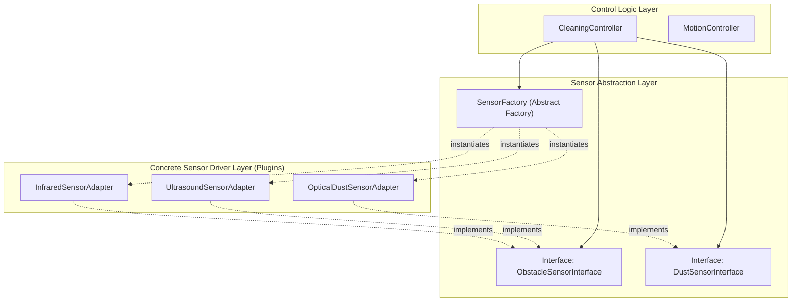
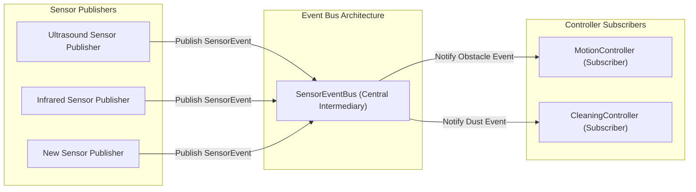
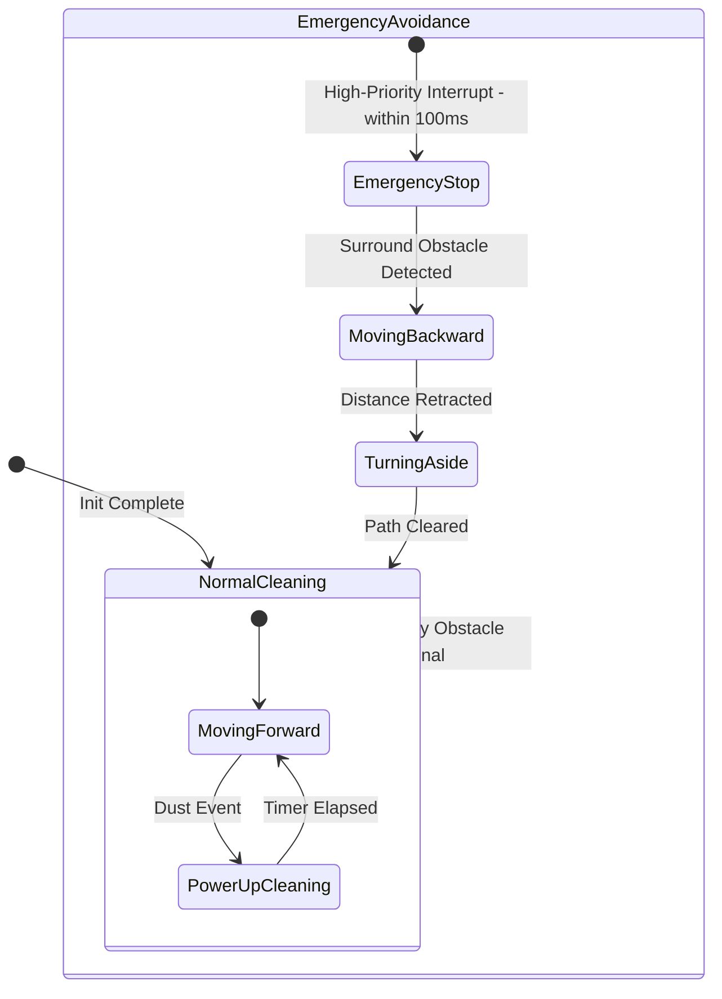
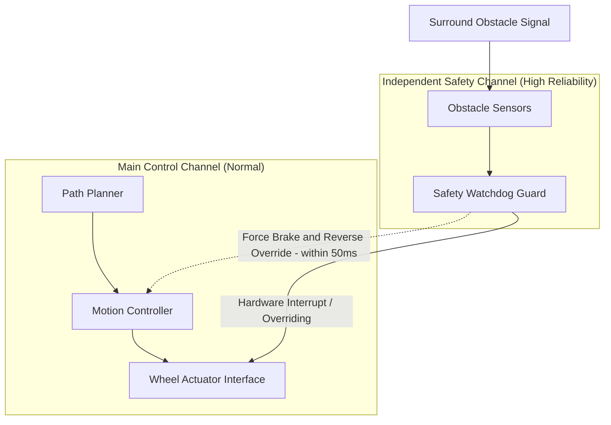

# Candidate Design Architecture (CDA) Specification for RVC SW Controller

## 1. 개요 (Overview)

본 문서는 `docs/Architectural_Drivers.md`에 정의된 품질 속성 요구사항(QA) 및 품질 속성 시나리오(QAS)를 만족시키기 위한 Candidate Design Architecture (CDA: 후보 아키텍처 대안)를 도출하고 상세 분석한 결과를 정의한다.

Architectural Drivers의 핵심 품질 속성인 **Modifiability(QAS-01)** 및 **Reliability & Safety(QAS-02)**를 만족시키기 위해 각 QA별로 2개 이상의 아키텍처 대안 후보를 도출하였다. 또한, 아키텍처 스타일(Architecture Style), 아키텍처 전술(Tactics), 디자인 패턴(Design Patterns), COTS 및 배포 패턴 등 **Design Concepts** 요소들을 반영하여 후보군을 구성하고 장단점을 다각도로 분석한다.

---

## 2. CDA List 표 (Candidate Design Summary)

| QA | QAS | Candidate Design | Candidate Design Approach (CDA) |
| :--- | :--- | :--- | :--- |
| **Modifiability** | **QAS-01** (센서 확장성 및 변경 용이성) | **CDA-01-A** Layered Plugin Architecture with Abstract Factory | 센서 하드웨어 의존성을 추상 인터페이스(`ISensor`)와 팩토리(`SensorFactory`)로 격리하여, 신규 센서 추가 시 기존 제어기 소스 코드 수정 없이(0 Files Modified) 신규 클래스 확장만으로 연동하는 구조 |
| **Modifiability** | **QAS-01** (센서 확장성 및 변경 용이성) | **CDA-01-B** Event Bus & Pub-Sub Data Driven Architecture | 중앙 센서 이벤트 버스(`SensorEventBus`)를 통해 센서 생산 모듈과 소비자(제어기) 간을 느슨하게 결합(Loose Coupling)하여, 신규 센서는 이벤트를 발행(Publish)만 하면 되도록 하는 확장 구조 |
| **Reliability & Safety** | **QAS-02** (장애물 회피 실시간 신뢰성 및 안전성) | **CDA-02-A** HFSM with Priority Preemptible Event Queue | 계층형 유한 상태 머신(HFSM)과 우선순위 선점형 이벤트 처리 루틴을 적용하여, 전방/양측면 비상 장애물 감지 시 100ms 이내에 최우선순위 선점(Preemption) 및 안전 후진/회전 전환을 보장하는 구조 |
| **Reliability & Safety** | **QAS-02** (장애물 회피 실시간 신뢰성 및 안전성) | **CDA-02-B** Dual-Channel Safe Watchdog Guard | 일반 주행 제어 경로와 독립된 감시 채널(`SafetyGuard`)을 두어, 장애물 센서 신호 발생 즉시 모터 인터페이스를 직접 인터럽트 제어하여 100ms 이내 비상 정지 및 충돌 결함률 0%를 보장하는 이중화 구조 |

---

## 3. CDA별 상세 분석 (Detailed Analysis)

### 3.1 Modifiability (QA-01: 센서 확장성 및 변경 용이성)

#### 3.1.1 CDA-01-A: Layered Plugin Architecture with Abstract Factory

##### 구조 시각화 (Mermaid Diagram)

##### 개요 설명
CDA-01-A는 계층형 아키텍처(Layered Architecture Style)에 기반하여 센서 드라이버 계층을 추상화 인터페이스와 팩토리 패턴으로 격리한 접근 방식이다. 
제어 로직(`CleaningController`)은 구체적인 센서 하드웨어에 전혀 의존하지 않으며, `ObstacleSensorInterface` 및 `DustSensorInterface`에만 의존한다.
적용된 **아키텍처 전술(Tactics)**은 **Maintain Abstract Interfaces** 및 **Restrict Dependencies**이며, **디자인 패턴**으로 **Abstract Factory**와 **Adapter Pattern**을 적용하여 신규 센서 추가 시 기존 소스 코드 수정 없이(변경 소스 0개) 신규 어댑터 클래스 추가만으로 100% 변경 용이성을 달성한다.

##### 장/단점 분석
- **장점 (Pros)**:
  - **OCP(Open-Closed Principle) 완벽 준수**: 신규 센서 요구사항 발생 시 기존 `CleaningController` 등 제어기 코드를 전혀 수정하지 않음.
  - **단위 테스트 용이성 (Testability)**: 가상 센서 Mock 객체를 인터페이스에 주입하여 쉽게 테스트 가능.
  - **구현 단순성**: 구조가 명확하고 객체지향 원칙에 충실하여 유지보수가 용이함.
- **단점 (Cons)**:
  - **동적 가비지 컬렉션/생성 오버헤드**: 객체 생성 팩토리 호출 시 간접 호출(Indirect Call) 레이턴시가 미세하게 발생할 수 있음.
  - **빌드 타임 결합**: C++ 환경에서 신규 센서 연동 시 빌드 타임에 어댑터 클래스가 서브시스템 팩토리에 정적 등록되어야 함.

---

#### 3.1.2 CDA-01-B: Event Bus & Pub-Sub Data Driven Architecture

##### 구조 시각화 (Mermaid Diagram)

##### 개요 설명
CDA-01-B는 암묵적 호출(Implicit Invocation / Pub-Sub Architecture Style) 방식을 채택하여 센서 생산자(Publisher)와 제어 소비 자(Subscriber)를 완전 분리한 데이터 구동형 아키텍처이다. 
센서 드라이버는 측정 데이터를 `SensorEventBus`로 발행(Publish)하고, 제어기는 필요한 이벤트 타입(장애물, 먼지 등)을 구독(Subscribe)하여 처리한다.
적용된 **아키텍처 전술(Tactics)**은 **Use Intermediary** 및 **Encapsulate**이며, **디자인 패턴**으로는 **Observer Pattern** 및 **Event Aggregator**를 활용한다. 신규 센서 추가 시 이벤트 버스에 신규 이벤트 타입만 등록하면 되어 상호 참조 관계가 0으로 수렴한다.

##### 장/단점 분석
- **장점 (Pros)**:
  - **극도의 결합도 감소 (Zero Coupling)**: 센서 모듈과 제어 모듈 간 직접적인 호출 관계가 전혀 없음.
  - **런타임 동적 확장성**: 실행 중(Runtime)에 동적으로 신규 센서 이벤트를 등록/해제 가능.
- **단점 (Cons)**:
  - **제어 흐름 추적의 복잡성**: 이벤트 중심 구조로 인해 디버깅 시 실행 흐름 추적이 다소 까다로움.
  - **이벤트 전송 메시지 오버헤드**: 이벤트 객체 래핑 및 디스패칭으로 인한 메모리 및 런타임 지연(Latency)이 발생할 수 있음.

---

### 3.2 Reliability & Safety (QA-02: 장애물 회피 실시간 신뢰성 및 안전성)

#### 3.2.1 CDA-02-A: HFSM with Priority Preemptible Event Queue

##### 구조 시각화 (Mermaid Diagram)

##### 개요 설명
CDA-02-A는 계층형 유한 상태 머신(HFSM: Hierarchical Finite State Machine Architecture Style)과 우선순위 선점형 이벤트 큐(Priority Queue)를 조합한 아키텍처이다.
이벤트 처리기 내에서 비상 장애물 감지 신호(전방+양측면) 발생 시, 일반 청소 이벤트를 선점(Preemption)하고 즉시 `EmergencyStop` 상태로 전환한다.
적용된 **아키텍처 전술(Tactics)**은 **Manage Executive Time**, **Fault Prevention**, **Limit Response Time**이며, **디자인 패턴**으로 **State Pattern** 및 **Command Pattern**을 적용한다. 이로써 100ms 이내에 구동 정지 및 후진/회전 시퀀스를 보장한다.

##### 장/단점 분석
- **장점 (Pros)**:
  - **상태 전환의 명확성**: 로봇 주행 상태 간(정상 청소 -> 비상 회피 -> 복귀)의 상태 전이 규칙이 엄격하고 명확함.
  - **결함 방지 및 결정론적 동작**: 상태 머신 특성상 정의되지 않은 동작으로 인한 충돌 결함(Failure)을 원천 차단(0%).
- **단점 (Cons)**:
  - **상태 폭발(State Explosion)**: 장애물 패턴 및 센서 조건이 극도로 복잡해질 경우 상태 전이 테이블이 비대해질 수 있음.
  - **단일 스레드 병목 위험**: 이벤트 큐 처리 루틴이 단일 메인 루프에 묶일 경우 동기식 블로킹에 주의해야 함.

---

#### 3.2.2 CDA-02-B: Dual-Channel Safe Watchdog Guard

##### 구조 시각화 (Mermaid Diagram)

##### 개요 설명
CDA-02-B는 물리적/논리적 이중 채널 구조(Dual-Channel / Safety Sandbox Pattern)를 적용한 하이 릴라이어빌리티 아키텍처이다.
메인 주행 제어 루틴과 독립된 `Safety Watchdog Guard`가 전방 및 양측면 센서를 직접 실시간 래치(Latch)하며, 비상 장애물 감지 시 메인 소프트웨어의 응답을 기다리지 않고 `Wheel Actuator Interface`를 직접 인터럽트 제어하여 모터를 정지 및 후진시킨다.
적용된 **아키텍처 전술(Tactics)**은 **Active Redundancy / Isolation**, **Fault Containment**, **Prevent Ripple Effect**이며, **디자인 패턴**으로 **Decorator** 및 **Guarded Suspension**을 적용한다. 제어 응답을 50ms 이내로 단축하여 극상의 안전성을 보장한다.

##### 장/단점 분석
- **장점 (Pros)**:
  - **초고속 응답성 (< 50ms)**: 메인 제어 루틴의 소프트웨어 연산 지연과 무관하게 하드웨어 인터럽트 수준으로 100ms 타깃을 대폭 상회 만족.
  - **독립적 안전 가디언**: 메인 제어기에 버그가 발생하더라도 독립된 Watchdog 채널이 로봇 충돌을 물리적으로 차단.
- **단점 (Cons)**:
  - **아키텍처 복잡도 증가**: 메인 채널과 세이프티 채널 간의 주행 제어권 동기화(Override release) 처리 필요.
  - **자원 사용량 증가**: 두 개의 제어 루틴이 병렬/동기적으로 대기해야 하므로 CPU 자원 사용량이 소폭 증가함.
