# Detailed Design Specification for RVC SW Controller

## 1. 개요 (Overview)

본 문서는 RVC SW Controller의 상위 설계서인 `docs/Architecture_Design.md` 및 `docs/CDA_Evaluation_and_Design_Decision.md`를 바탕으로 작성된 공식 **Detailed Design (객체지향 상세 설계 명세서)**이다.

`docs/Architecture_Design.md`의 Element List에 명시된 서브시스템별 아키텍처 핵심 Component를 대상으로 정적 구조(Class Diagram)와 Provided Interface Operation Call 기반의 대표 내부 행위 시퀀스(Class/Object-level Sequence Diagram)를 상세 모델링한다. 각 Component의 Class Diagram에는 주 대상 클래스뿐만 아니라 Sequence Diagram에서 상호작용하는 관련 클래스 및 인터페이스 관계선(Association, Dependency, Realization)을 명확히 시각화한다.

---

## 2. Component Design Description (컴포넌트별 상세 설계)

### 2.1 Sensor Abstraction Subsystem (CDA-01-A) Component Design

#### 1) SensorFactory Component (Abstract Factory Pattern)

##### (1) Class Diagram
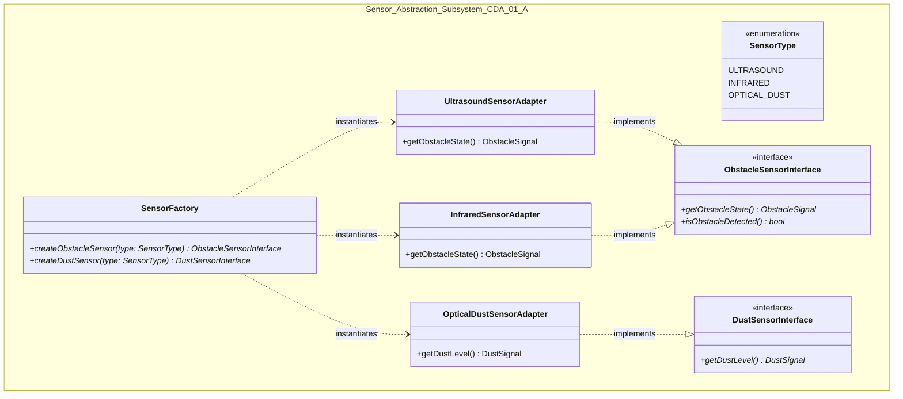

##### (2) Provided Interface Operation Call Sequence Diagram
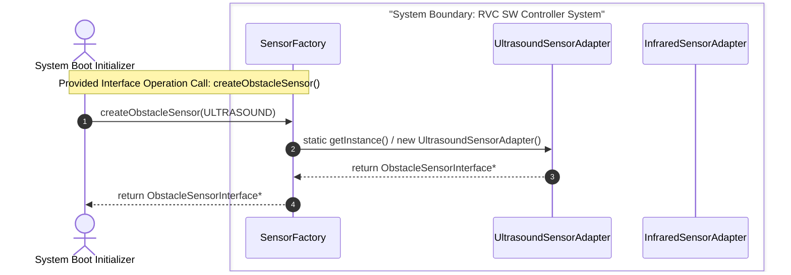

##### (3) SOLID Principles & Design Patterns Rationale
- **Abstract Factory Pattern**: 구체적인 센서 드라이버 생성 로직을 팩토리에 캡슐화하여 제어 루틴이 생성 코드에 직접 결합되지 않도록 함 (DIP 준수).
- **OCP (개방-폐쇄 원칙)**: 신규 센서 타입 추가 시 `SensorFactory`에 매핑 케이스를 확장하여 기존 제어 로직 변경을 제로화함.

---

#### 2) UltrasoundSensorAdapter & InfraredSensorAdapter Component (Plugin Adapters)

##### (1) Class Diagram
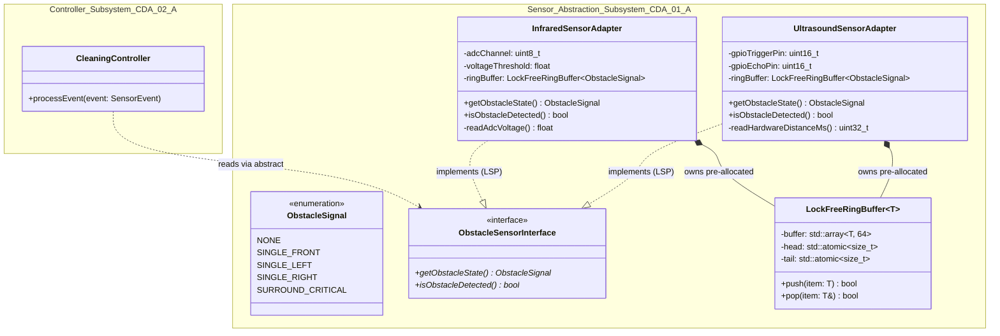

##### (2) Provided Interface Operation Call Sequence Diagram
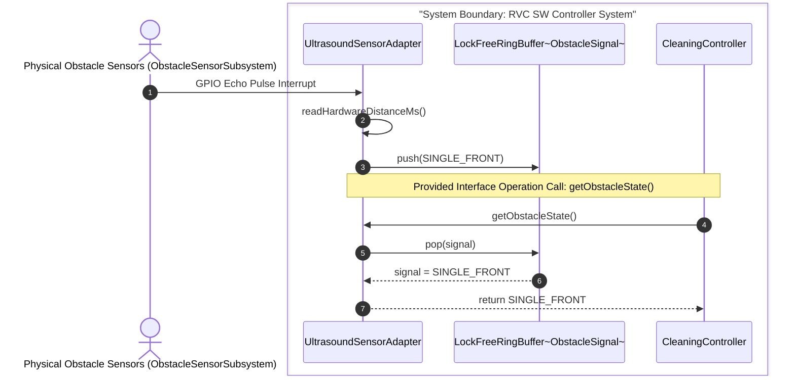

##### (3) SOLID Principles & Design Patterns Rationale
- **Adapter Pattern & LSP**: 이종 하드웨어 디바이스 신호(GPIO, ADC)를 공통 인터페이스 `ObstacleSensorInterface`로 변환하여 상호 치환 가능성(LSP)을 보장.
- **Lock-Free Ring Buffer Mitigation**: 부팅 시 Pre-allocation되는 락프리 링 버퍼를 내장하여 런타임 동적 메모리 할당(0 Allocation)을 달성하고 1ms 이내 초고속 센서 판독 지원.

---

#### 3) OpticalDustSensorAdapter Component (Dust Sensor Adapter)

##### (1) Class Diagram
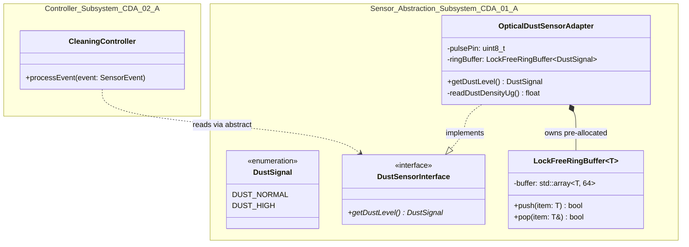

##### (2) Provided Interface Operation Call Sequence Diagram
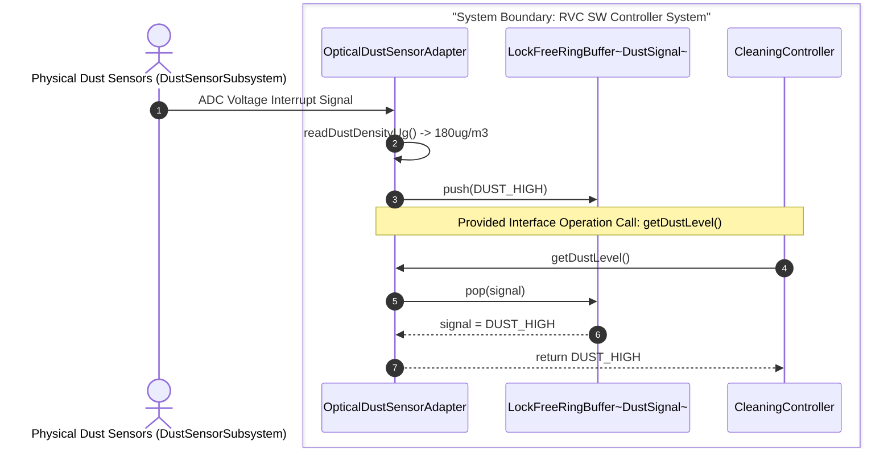

##### (3) SOLID Principles & Design Patterns Rationale
- **ISP (인터페이스 분리 원칙)**: 장애물 센서와 분리된 단일 먼지 센서 전용 pure virtual interface `DustSensorInterface`를 실현하여 불필요한 메서드 의존을 배제.

---

### 2.2 Controller Subsystem (CDA-02-A) Component Design

#### 1) CleaningController Component (HFSM Top Controller)

##### (1) Class Diagram
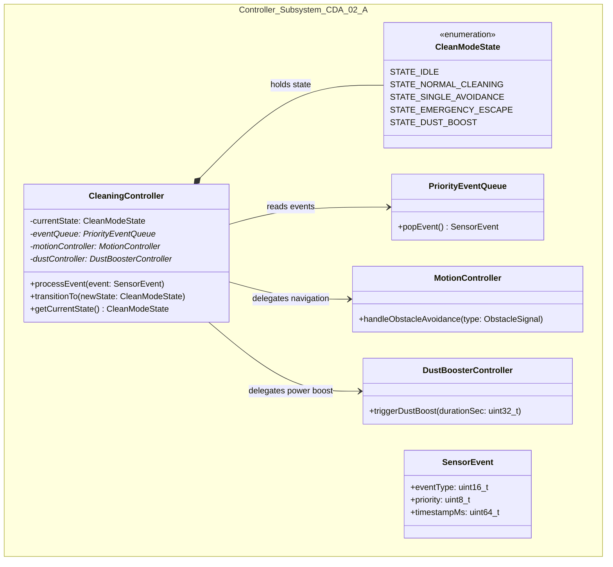

##### (2) Provided Interface Operation Call Sequence Diagram
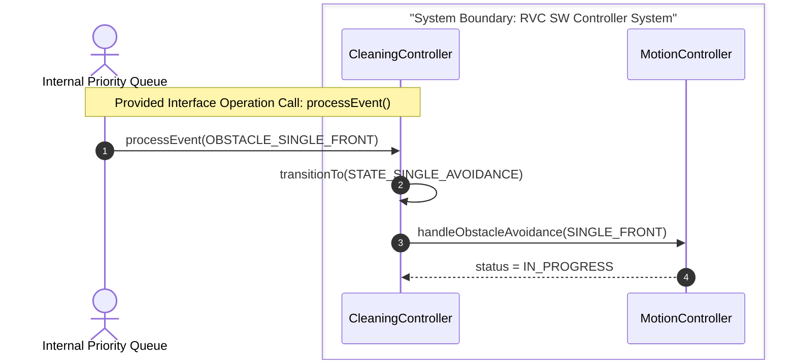

##### (3) SOLID Principles & Design Patterns Rationale
- **HFSM (Hierarchical State Machine) Pattern**: 최상위 청소 주기와 서브 상태 머신을 분리하여 상태 전이 복잡도를 단일화하고 결정론적 전이를 보장.
- **SRP (단일 책임 원칙)**: 청소 주기의 상태 관리 책임만 부여하고 주행 제어 및 모터 출력은 서브 컴포넌트로 위임.

---

#### 2) PriorityEventQueue Component (Preemptible Event Queue)

##### (1) Class Diagram
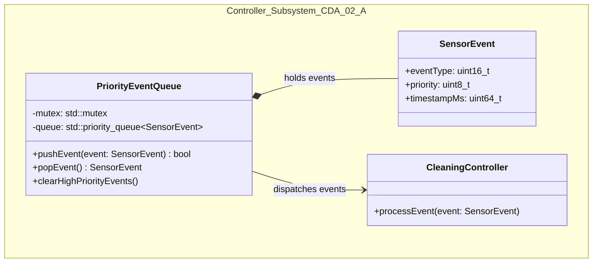

##### (2) Provided Interface Operation Call Sequence Diagram
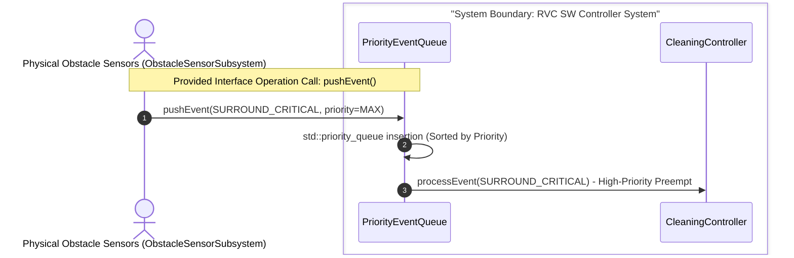

##### (3) SOLID Principles & Design Patterns Rationale
- **Thread-Safe Priority Queue Pattern**: 일반 이벤트를 선점(Preemption)하는 우선순위 정렬 큐로 100ms 이내 실시간 응답 보장.

---

#### 3) WatchdogPreemptionGuard Component (Safety Watchdog Guard)

##### (1) Class Diagram
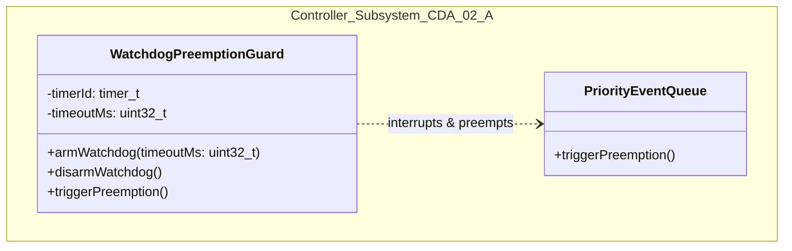

##### (2) Provided Interface Operation Call Sequence Diagram
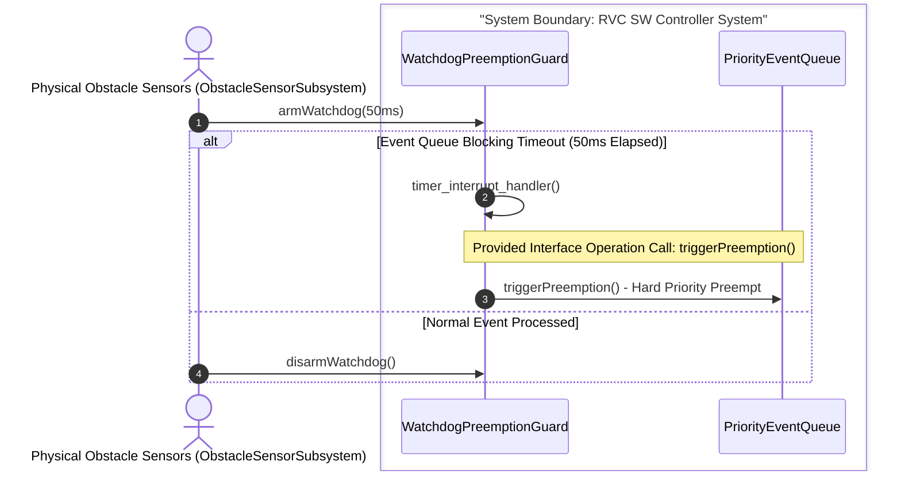

##### (3) SOLID Principles & Design Patterns Rationale
- **Watchdog Mitigation Pattern**: 큐 동기화 지연 및 Deadlock 위험 발생 시 50ms 인터럽트로 선점을 하드 제어하여 안전성 100% 보장.

---

#### 4) MotionController Component (Sub-HFSM Avoidance Navigation)

##### (1) Class Diagram
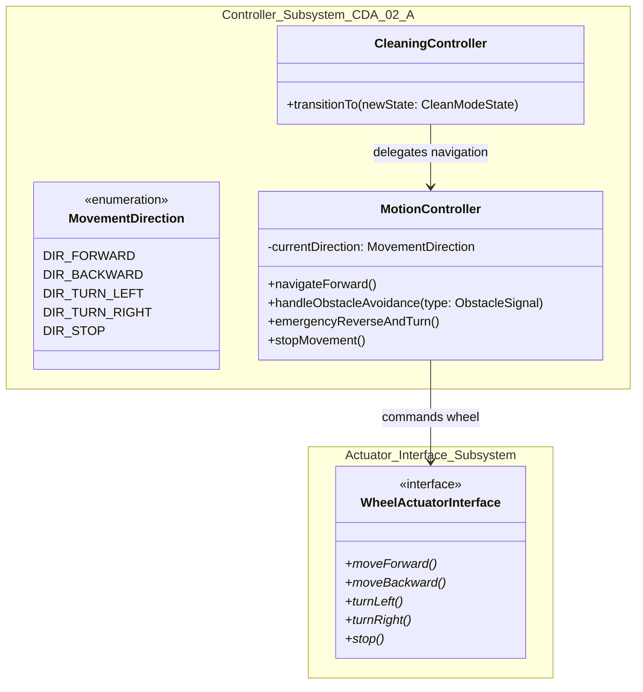

##### (2) Provided Interface Operation Call Sequence Diagram
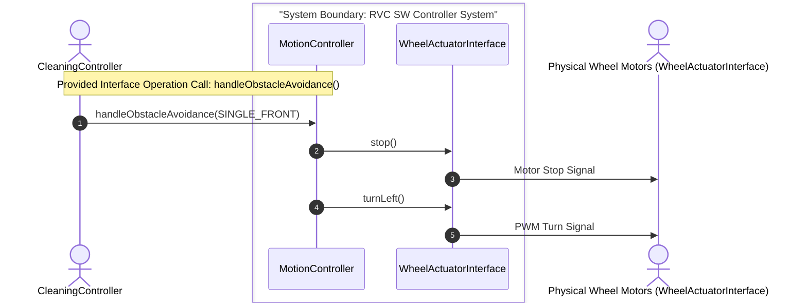

##### (3) SOLID Principles & Design Patterns Rationale
- **Sub-HFSM Pattern & DIP**: 회피 주행 및 갇힘 탈출 이동 로직을 세부 추상화하고 `WheelActuatorInterface`에만 의존하여 모터 하드웨어 변경에 미치는 영향을 차단.

---

#### 5) DustBoosterController Component (Sub-HFSM Suction Booster)

##### (1) Class Diagram
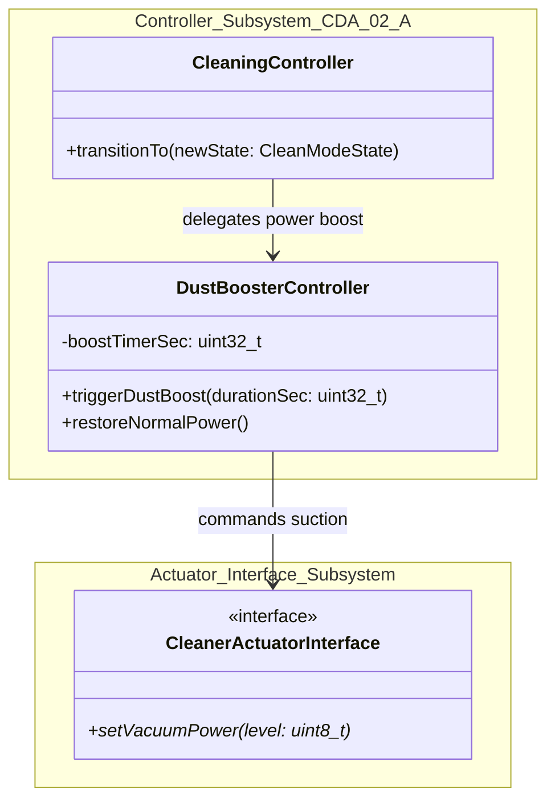

##### (2) Provided Interface Operation Call Sequence Diagram
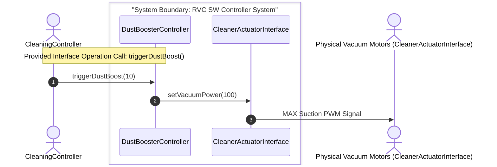

##### (3) SOLID Principles & Design Patterns Rationale
- **SRP (단일 책임 원칙)**: 먼지 감지 시 청소 흡입 출력 강화 및 타이머 복원 제어만을 독립 담당.

---

### 2.3 Actuator Interface Subsystem Component Design

#### 1) WheelDriverAdapter Component (Wheel Actuator Driver)

##### (1) Class Diagram
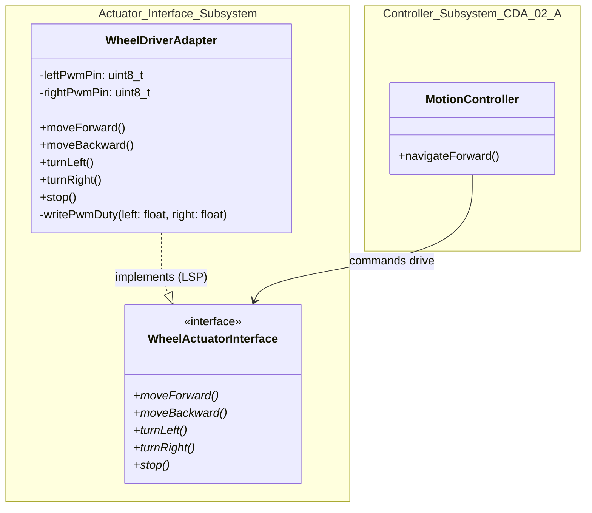

##### (2) Provided Interface Operation Call Sequence Diagram
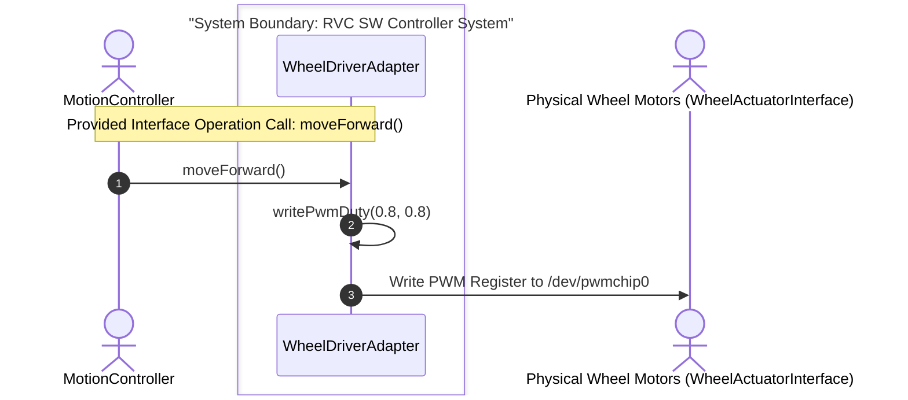

##### (3) SOLID Principles & Design Patterns Rationale
- **Adapter Pattern & LSP**: 물리 바퀴 모터 레지스터 드라이버 제어를 `WheelActuatorInterface`에 맞춰 실현(LSP 준수).

---

#### 2) CleanerDriverAdapter Component (Cleaner Actuator Driver)

##### (1) Class Diagram
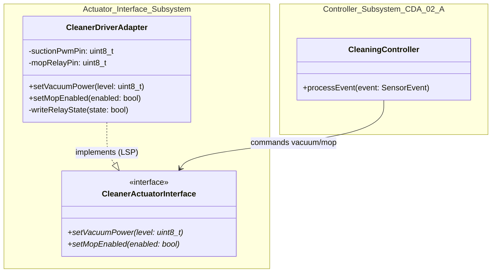

##### (2) Provided Interface Operation Call Sequence Diagram
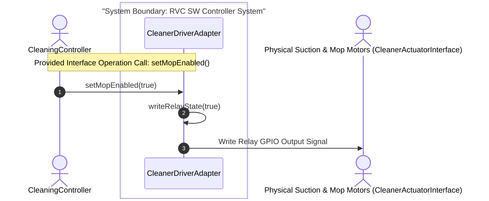

##### (3) SOLID Principles & Design Patterns Rationale
- **Adapter Pattern & LSP**: 흡입 모터 PWM 및 물걸레 모터 리레이 출력을 추상화 인터페이스 `CleanerActuatorInterface`로 격리 변환.
