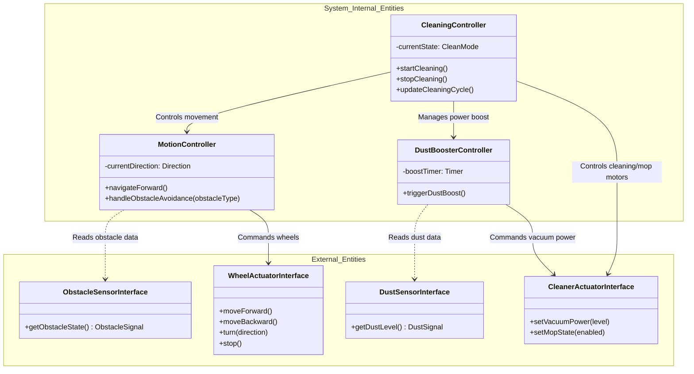

# Domain Model Specification for RVC SW Controller

## 1. 개요 (Overview)
본 문서는 RVC SW Controller의 개념적 개체와 이들 간의 관계를 정의한 Domain Model 명세서이다. System Context Diagram과 Use Case Model 분석을 바탕으로 외부 인터페이스 개체와 시스템 내부 제어 개체를 구별하여 도메인 모델을 구성하였다.

---

## 2. Domain Model Diagram

---

## 3. Domain Entities Description

### 3.1 외부 인터페이스 개체 (External Candidates)

- **ObstacleSensorInterface**: 전방 및 양측면 장애물 감지 센서로부터 장애물 감지 신호를 수집하여 MotionController로 전달하는 도메인 개체이다.
- **DustSensorInterface**: 바닥면 먼지 감지 센서의 데이터를 읽어와 먼지 발생 유무를 DustBoosterController로 전달하는 개체이다.
- **WheelActuatorInterface**: RVC의 구동 모터(바퀴)에 직접 명령을 전달하여 직진, 후진, 정지, 방향 전환(좌/우)을 실행하는 하드웨어 추상화 인터페이스 개체이다.
- **CleanerActuatorInterface**: 흡입 모터, 물걸레 모듈, 파워 부스터 장치에 출력 제어 신호를 전달하는 하드웨어 추상화 인터페이스 개체이다.

### 3.2 내부 제어 개체 (Internal Candidates)

- **CleaningController**: RVC 전체 청소 상태(일반 청소, 물걸레질 등)와 청소 주기를 총괄 관리하는 핵심 도메인 개체이다.
- **MotionController**: 장애물 감지 상태에 따라 직진, 우회 회전, 갇힘 탈출 후진 등 RVC의 이동 주행 경로 및 회피 로직을 제어한다.
- **DustBoosterController**: 먼지 센서의 감지 신호에 응답하여 지정된 시간 동안 청소 흡입력을 최고 출력으로 강화 및 복구 제어한다.
