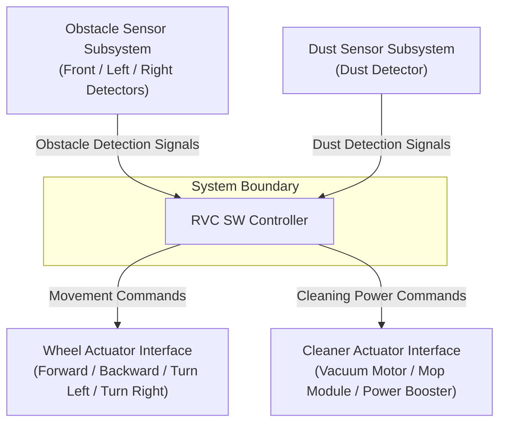

# System Requirement Specification for RVC SW Controller

## 1. 개요 (Overview)
본 문서는 로봇 청소기(Robotic Vacuum Cleaner, RVC)의 자동 청소 기능을 제어하는 **RVC SW Controller**의 시스템 요구사항 명세서이다. 본 명세서는 확장/미지원 기능을 제외한 현재 버전의 핵심 자동 청소 요구사항을 바탕으로 이해관계자 식별, 기능/비기능/품질속성 요구사항 분류, 추적성 라벨링 및 System Context Diagram(SCD)을 포함한다.

---

## 2. 변경 영향 분석 (Impact Analysis of Requirement Change)
- **변경 사항**: 향후/확장 요구사항(`FR-06 제자리 순환 청소`, `FR-07 모바일 앱 연동`, `FR-08 ML 추론 청소`) 삭제 및 현재 미지원 기능으로 처리.
- **영향 범위**:
  - **이해관계자**: 모바일 사용자 및 `STK-GOAL-03` 제거.
  - **기능 요구사항**: `FR-06`, `FR-07`, `FR-08` 삭제 (현재 버전은 `FR-01` ~ `FR-05` 5개 기본 기능으로 한정).
  - **시스템 경계(SCD)**: 외부 인터페이스 중 `MobileAppInterface` 및 `MLEngineInterface` 삭제.
  - **아키텍처 영향**: `UC-05`, `UC-06`, `UC-07` 및 연관 도메인 객체(`MobileAppInterface`, `MLEngineInterface`, `SpotCleaningController`, `RemoteCommunicationHandler`, `MLInferenceClient`) 삭제.

---

## 3. 이해관계자 및 목표 (Stakeholders & Goals)

| Stakeholder | Needs / Concerns / Interests | Goal ID | Goal Description |
| :--- | :--- | :--- | :--- |
| **사용자 / 집주인 (Homeowner)** | - 바닥면의 자동 청소 및 물걸레질 - 장애물 충돌 방지 및 안전한 구동 - 먼지 감지 시 강력한 청소 | `STK-GOAL-01` `STK-GOAL-02` | - 바닥 자동 청소 및 물걸레질, 먼지 감지 시 집중 청소 수행 - 장애물 감지 시 멈춤/회전/후진을 통한 충돌 예방 |
| **HW / 시스템 개발자** | - HW 세부 제어와 SW 제어의 분리 - 센서 변경 및 추가 용이성 | `STK-GOAL-03` | - HW 독립적인 SW 제어 구조 설계 및 센서 확장 유연성 확보 |
| **SW PM / 유지보수자** | - 시스템 신뢰성 및 모듈화 구조 | `STK-GOAL-04` | - 센서 변경에 유연한 모듈화 구조 및 높은 시스템 안정성 확보 |

---

## 4. 요구사항 명세 (System Requirements)

### 4.1 기능 요구사항 (Functional Requirements, FR)

| ID | 요구사항명 | 상세 설명 | 추적성 (Goal ID) |
| :--- | :--- | :--- | :--- |
| **FR-01** | 자동 청소 및 물걸레질 | RVC는 가정 내 바닥 면(Household surface)을 자동으로 청소(Cleaning)하고 물걸레질(Mopping)을 수행한다. | `STK-GOAL-01` |
| **FR-02** | 기본 직진 이동 | 청소 모드 작동 중 기본적으로 직진(Straight forward) 이동하며 청소한다. | `STK-GOAL-01` |
| **FR-03** | 단일/측면 장애물 회피 | 전방 또는 측면 센서에서 장애물이 감지되면 즉시 청소를 멈추고, 좌측 또는 우측으로 회전한 후 직진 청소를 재개한다. | `STK-GOAL-02` |
| **FR-04** | 전방 및 양측면 장애물 회피 | 전방, 좌측, 우측 모두에서 장애물이 감지되면 후진(Move backward)한 후, 좌측 또는 우측으로 회전하여 직진 청소를 재개한다. | `STK-GOAL-02` |
| **FR-05** | 먼지 집중 청소 | 먼지 감지 센서로부터 먼지가 감지(Detect dust)되면 일정 시간 동안 청소 출력을 강화(Power up cleaning)한다. | `STK-GOAL-01` |

---

### 4.2 비기능 요구사항 및 제약사항 (Non-Functional Requirements & Constraints, CON)

| ID | 구분 | 상세 설명 | 추적성 (Goal ID) |
| :--- | :--- | :--- | :--- |
| **CON-01** | 개발 제약 (Development) | 하드웨어 제어의 세부 설계 및 구현은 고려 대상에서 제외하며, 자동 청소 제어 소프트웨어 로직에 집중한다. | `STK-GOAL-03` |
| **CON-02** | 기술 제약 (Technical Stack) | 시스템 SW는 C++ 언어로 개발하며, SOLID 객체지향 설계 원칙을 준수하고, 단체 및 단위 테스트 프레임워크로 Google Test(gtest)를 사용한다. | `STK-GOAL-04` |
| **CON-03** | 운영 제약 (Operation) | 실내 가정 환경의 바닥(Household surface) 조건에서 작동한다. | `STK-GOAL-01` |

---

### 4.3 품질 속성 (Quality Attributes, QA)

| ID | 품질 속성 | 상세 설명 | 추적성 (Goal ID) |
| :--- | :--- | :--- | :--- |
| **QA-01** | 유연성 / 변경 용이성 (Modifiability) | 센서의 추가 또는 사양 변경(Add or change sensors) 시 기존 소프트웨어 코드의 변경을 최소화할 수 있는 추상화 인터페이스 구조를 갖춘다. | `STK-GOAL-03`, `STK-GOAL-04` |
| **QA-02** | 신뢰성 / 안전성 (Reliability / Safety) | 장애물 감지 시 오작동 없이 즉시 정지 및 회피 동작을 수행하여 충돌을 방지한다. | `STK-GOAL-02`, `STK-GOAL-04` |

*Note: 본 시스템 요구사항 명세서의 품질 속성(Quality Attributes)은 전통적인 소프트웨어 제품 품질 모델 표준인 **ISO/IEC 25010:2023** (Maintainability - Modifiability, Reliability, Safety)의 정의 및 품질 체계를 기반으로 선정하고 명시함.*

---

## 5. 시스템 컨텍스트 다이어그램 (System Context Diagram, SCD)

`RVC SW Controller`를 중심으로 한 시스템 경계(System Boundary) 및 외부 시스템/장치(External Entities)와의 인터페이스 관계는 다음과 같다.

