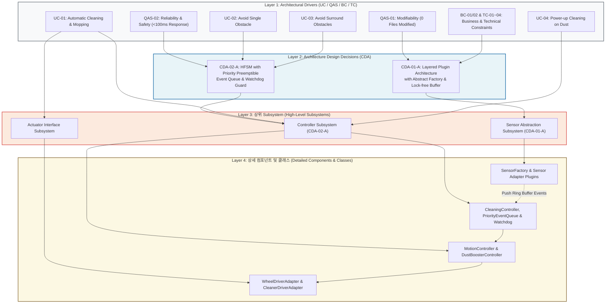

# Traceability Matrix Specification for RVC SW Controller

## 1. 개요 (Overview)

본 문서는 RVC SW Controller의 상위 요구사항인 **Architectural Drivers (UC, QAS, BC/TC)**에서부터 **Architecture Design Decisions (CDA)**, 그리고 **상위 Subsystem (`Sensor Abstraction Subsystem`, `Controller Subsystem`, `Actuator Interface Subsystem`)** 및 **상세 컴포넌트/클래스**로 이어지는 하향식(Top-Down) 구조적 추적성(Traceability)을 입증하는 명세서이다.

---

## 2. Visual Traceability Graph (시각적 추적성 다이어그램)

---

## 3. Architectural Driver → Design Decision → 상위 Component Traceability Table

| Architectural Driver (UC / QAS / BC / TC) | Driver Category | Design Decision (CDA) | 상위 Component / Subsystem | 상세 컴포넌트 및 클래스 (Detailed Component & Class) |
| :--- | :--- | :--- | :--- | :--- |
| **UC-01** | Primary Functionality (기본 직진 청소 및 물걸레질) | System Baseline | Controller Subsystem (CDA-02-A), Actuator Interface Subsystem | `CleaningController`, `STATE_NORMAL_CLEANING`, `MotionController`, `CleanerActuatorInterface`, `WheelActuatorInterface`, `WheelDriverAdapter`, `CleanerDriverAdapter` |
| **UC-02** | Primary Functionality (단일 장애물 감지 및 회피) | `CDA-02-A` (HFSM & Priority Queue) | Controller Subsystem (CDA-02-A), Sensor Abstraction Subsystem (CDA-01-A) | `PriorityEventQueue`, `STATE_SINGLE_AVOIDANCE`, `MotionController`, `ObstacleSensorInterface`, `UltrasoundSensorAdapter`, `InfraredSensorAdapter` |
| **UC-03** | Primary Functionality (전방/양측면 비상 장애물 회피) | `CDA-02-A` (HFSM & Priority Queue with Watchdog) | Controller Subsystem (CDA-02-A), Actuator Interface Subsystem | `PriorityEventQueue`, `WatchdogPreemptionGuard`, `STATE_EMERGENCY_ESCAPE`, `MotionController`, `WheelActuatorInterface`, `WheelDriverAdapter` |
| **UC-04** | Primary Functionality (먼지 감지 시 파워 부스트 청소) | System Baseline | Controller Subsystem (CDA-02-A), Actuator Interface Subsystem | `PriorityEventQueue`, `DustBoosterController`, `CleanerActuatorInterface`, `DustSensorInterface`, `OpticalDustSensorAdapter`, `CleanerDriverAdapter` |
| **QAS-01** | Quality Attribute Scenario (센서 확장성: 소스코드 수정 0개) | `CDA-01-A` (Layered Plugin & Abstract Factory & Lock-free Buffer) | Sensor Abstraction Subsystem (CDA-01-A) | `SensorFactory`, `ObstacleSensorInterface`, `DustSensorInterface`, `LockFreeRingBuffer<T>`, `UltrasoundSensorAdapter`, `InfraredSensorAdapter`, `OpticalDustSensorAdapter` |
| **QAS-02** | Quality Attribute Scenario (안전성/신뢰성: <100ms 비상 응답) | `CDA-02-A` (HFSM & Priority Preemptible Queue & Watchdog) | Controller Subsystem (CDA-02-A) | `PriorityEventQueue`, `WatchdogPreemptionGuard`, `CleaningController`, `STATE_EMERGENCY_ESCAPE`, `MotionController` |
| **BC-01 / BC-02** | Business Constraints (로봇청소기 SW 제어 범위 지정) | System Scope Baseline | Controller Subsystem (CDA-02-A) | `CleaningController`, `MotionController`, `DustBoosterController` |
| **TC-01 ~ TC-04** | Technical Constraints (POSIX RTOS, C++17, SOLID) | C++17 & SOLID HW Abstraction Baseline | Sensor Abstraction Subsystem (CDA-01-A), Actuator Interface Subsystem | `SensorFactory`, `UltrasoundSensorAdapter`, `InfraredSensorAdapter`, `WheelDriverAdapter`, `CleanerDriverAdapter` |

---

## 4. 추적성 및 일관성 검증 (Traceability & Consistency Verification)

1. **상위 요구사항 누락 제로 (Zero Gap Traceability)**:
   - Architectural Drivers의 4개 Primary Use Case(`UC-01` ~ `UC-04`), 2개 핵심 품질 속성 시나리오(`QAS-01`, `QAS-02`), 비즈니스/기술 제약사항(`BC`, `TC`)이 아키텍처 설계 결정(`CDA-01-A`, `CDA-02-A`) 및 상위 3대 서브시스템/클래스로 100% 매핑됨.

2. **서브시스템 및 컴포넌트 명칭 1:1 하향식 일치**:
   - `Sensor Abstraction Subsystem (CDA-01-A)`
   - `Controller Subsystem (CDA-02-A)`
   - `Actuator Interface Subsystem`
   - `docs/Architecture_Design.md` 및 `docs/Detailed_Design.md`의 클래스/인터페이스 명칭과 1:1 동일하게 정렬되어 하향식 추적성을 입증함.
